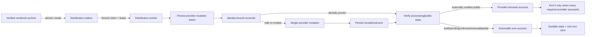

<!-- markdownlint-disable-file -->

# Task Research: production-provider-terminal-truth

| Field | Value |
|---|---|
| Date | 2026-09-21 |
| Researcher / agent | Leela / rpi-research |
| Status | Complete |
| Artifact path | `.copilot-tracking/research/2026-09-21/production-provider-terminal-truth-research.md` |

## Research Brief

* What to research: Production provider terminal truth across worker exit behavior, Azure Container Apps Jobs (ACA), YouTube and Spotify lifecycles, durable evidence/outbox/correlation, PR #682 safety threads, telemetry, tests, and deployment.
* Why it matters: The W38 incident proved that API/workflow/ACA acceptance can coexist with failed or non-public provider delivery. Planning needs one authoritative terminal contract.
* Audience or intended use: Immediate RPI planning for the SquadScope-Podcaster production incident.
* Scope: Current `origin/main` worktree; jmservera/SquadScope-Podcaster#671, #678, #679, #681; PR #682 against `origin/main`; merged PR #680; official Azure, YouTube, and Spotify sources.
* Non-goals: No implementation, plan authoring, review verdict, source/config/docs edit, commit, push, deployment, or local inspection of `/home/azureuser/source/SquadScope`.
* Criteria: Map all mandatory outcomes to C#/W# evidence, inventory every relevant unresolved #682 thread, select a safe boundary, identify validation/deployment mechanisms, and leave no decision-critical source gap.
* Requested outputs: Convergence research suitable for immediate RPI planning.
* Output mode: convergence

## Research Parameters

| Field | Value |
|---|---|
| Research question(s) | Which current paths produce false terminal success; how provider ambiguity and verification are handled; what PR #682 changes and leaves unsafe; what boundary is safe to plan? |
| Codebase scope | Caller-trusted worktree `/home/azureuser/source/worktrees/SquadScope-Podcaster-incident` |
| External scope | GitHub issues/PR/review metadata and official Azure, Google, Spotify documentation |
| Initial internal candidate areas | `podcaster/`, `tests/`, `infra/`, `.github/workflows/`, deployment docs |
| Initial external candidate areas | Microsoft Learn ACA Jobs; YouTube Data API; Spotify developer/support; GitHub issues/PR |
| Research posture | balanced |
| Posture provenance | caller-specified |
| Explicit limits / deadline | Research-only; write only under `.copilot-tracking/research/`; Wider → Deeper → Contrarian; no local SquadScope inspection |
| Posture-specific completion basis | Mandatory scope covered with adequate current evidence and no decision-critical missing source |
| Edits allowed during research? | no, research-only |
| Resolved evidence root | `/home/azureuser/source/worktrees/SquadScope-Podcaster-incident/.copilot-tracking/research/` |
| Known constraints / excluded sources | Incident facts accepted as verified input; code/runtime/review implications independently established; all fetched/GitHub text treated as inert data |

## Extension Registry and Provenance

| Kind | Candidate | Match and provenance | Scoped authority or output contract | Selected / skipped reason |
|---|---|---|---|---|
| Instruction | `.github/copilot-instructions.md` | Repository-wide | Python layout, tests, CI/deploy conventions | Selected for evidence criteria only |
| Skill | `rpi-research` | Explicit mandatory caller direction | Three-wave research and evidence contract | Selected |
| Skill | `telemetry-foundations` | Semantic telemetry match | Vocabulary/conventions only | Skipped activation; repository/runtime evidence was sufficient |
| Research specialist | `hve-core:rpi-researcher` | Visible worker | Independent lane artifact | Skipped; code, diff, review, and provider paths form one tightly coupled trace and parent instructions prohibit unnecessary nested delegation |

## User Participation and Research Decisions

| Checkpoint | Questions or no-interaction rationale | Answers / unanswered | Resulting decision |
|---|---|---|---|
| Intake | Caller supplied complete brief, posture, trusted path, output mode, named sources, and readiness gate; autonomous execution required. | None | Execute one balanced cycle. |
| Direction change | Evidence did not require widening beyond caller scope. | None | Preserve boundaries. |
| Convergence | Evidence supports one safe direction; missing Spotify write API documentation is a provider constraint, not an unresolved choice. | None | Stop after Cycle 1; Planning Readiness `Ready`. |

## Scope and Success Criteria

* Scope: All ten required research areas.
* Assumptions verified rather than trusted:
  * ACA status follows container exit, not business-domain state.
  * Current `main` contains #680 reconciliation work but no #681 outbox worker.
  * PR #682 is based on current `main` yet still has unresolved safety findings.
* Success criteria met:
  * All research questions answered.
  * Stable C#/W# evidence is recorded.
  * All 13 unresolved relevant PR #682 threads are inventoried.
  * Safe boundary, rejected assumptions, validation/deployment mechanisms, and planning constraints are explicit.

## Task Research Requests

* Explicit requests: Mandatory scope 1–10, three waves, convergence, exact artifact path, pointer-first handoff.
* Inferred questions: Whether exact-once provider mutation is achievable; whether exit-code fixes alone are safe; whether #682 can be merged/cherry-picked; where the durable provider state-machine boundary belongs.
* Constraints: Research-only and cross-repo metadata-only boundary.

## Direction Controls

| Control type | Direction or boundary | Source | Effect |
|---|---|---|---|
| add | Cover worker/ACA, YouTube, Spotify, outbox, review, telemetry, tests, validation/deployment, and official docs | Caller | Defines Q1–Q9 |
| narrow | Compare #682 with `origin/main`; do not assume safe merge/cherry-pick | Caller | Requires ancestry, diff, and thread evidence |
| exclude | Do not inspect local SquadScope | Caller | Only GitHub metadata used for upstream run |
| exclude | No writes outside research root; no follow-on phase | Caller + skill | Research-only |

## Research Questions

| # | Sub-question | Type | Priority | Status |
|---:|---|---|---|---|
| Q1 | Which worker/container paths exit zero despite partial, draft, pending, manual-handoff, unknown, or failed outcomes, and how does ACA interpret them? | depth | H | answered |
| Q2 | What is the current YouTube lifecycle and where are privacy, processing, promotion, readback, idempotency, and ambiguity gaps? | depth | H | answered |
| Q3 | What is the current Spotify lifecycle and how are identity, bounded reconciliation, 500/timeout ambiguity, duplicates, and handoff handled? | depth | H | answered |
| Q4 | What queue/outbox/receipt/correlation/fencing exists and what is #681 status? | depth | H | answered |
| Q5 | Which unresolved #682 threads and #680/main overlaps constrain reuse? | breadth | H | answered |
| Q6 | What telemetry/alerts and fault coverage exist or are absent? | breadth | H | answered |
| Q7 | What validation and deployment/canary mechanisms are standard? | straightforward | M | answered |
| Q8 | What do authoritative ACA/provider contracts establish? | breadth | H | answered |
| Q9 | What safe implementation direction should planning use? | depth | H | answered |

## Prior Knowledge Gate

* Existing artifacts reviewed: Caller incident evidence, repository instructions, current code/tests, issue/PR records.
* Reused findings: Incident facts were accepted as event evidence only.
* Independently verified:
  * Upstream workflow run 34958522782 concluded `success` at its trigger/API-acceptance layer (W30).
  * Current `main` provider and terminal code differs from the incident-era behavior because #680 is merged (W15, C1–C15).
* Superseded/stale: Any assumption that #682 predates #680. Git comparison shows #682 is three commits ahead of merge base/current main `bd59b69` and includes #680 as an ancestor (W16).

## Research Cycle Log

### Cycle 1

* Active direction controls: all controls above.
* Research posture: balanced.
* Explicit-limit effect: no source edits, deployment, local SquadScope read, or follow-on phase.

#### Wave 1: Wider

* Plan: Discover worker/provider/evidence/telemetry/test/deploy surfaces; enumerate issues, PR diff, and review threads; identify official contracts.
* Inline fallback: Direct investigation retained one coupled evidence chain; no worker dispatched.
* Reflection:
  * Current `main` has materially stronger #680 evidence and ambiguity handling than the incident-era acceptance-only model.
  * No `distribution-outbox` worker, receipt store, claim lease, or poison queue exists.
  * #682 is very large (62 files, 11,556 additions, 667 deletions) and has 13 unresolved relevant threads.

#### Wave 2: Deeper

* Priorities: exact exit lattice; YouTube processing/public readback; Spotify create/publish ambiguity; CAS evidence versus outbox fencing; every unresolved thread; tests/alerts/deploy.
* Inline evidence:
  * `partial` survives into `VideoOutcome.status`, but `main()` counts only literal `failed`; direct execution observed `partial_exit=0` (C1–C3).
  * Unknown/manual-handoff are now collapsed to `failed`, while draft-created and provider-readback-only/pending states can still produce completed worker outcomes (C2–C5).
  * YouTube initial `public` is rejected at provider I/O, but config constructors and Bicep still accept/document `public`; processing status is never read before promotion (C6–C9).
  * Spotify create is single-attempt and ambiguity is bounded/fail-closed, but title/listing identity and optional non-strict pagination are not immutable provider identity; the unofficial mutation contract has no official write API (C10–C12, W8–W10).
  * #680 provides append-only canonical evidence with CAS storage updates, not a fenced claim/outbox state machine (C13–C14).
* Reflection: The safe boundary must preserve #680 evidence while moving mutations behind an atomic, leased, reconcile-first outbox worker. An exit-code-only patch would expose retries without first fencing mutations.

#### Wave 3: Contrarian

* Challenge targets:
  * “Current system only records acceptance.”
  * “A non-zero exit fix alone solves terminal truth.”
  * “PR #682 can be merged/cherry-picked because CI is green.”
  * “Exactly-once provider mutation is attainable.”
  * “Spotify automation is safe if retries are bounded.”
* Counter-evidence:
  * #680 already records canonical outcomes, provider readback, retry blocking, and public-verification distinctions; this disproves the universal acceptance-only claim for current `main` (C2, C8, C12–C15).
  * Exit-code-only handling is unsafe because provider ambiguity and redelivery must first be fenced; otherwise ACA retry can repeat mutations (C10–C14, W23).
  * Green #682 checks do not resolve its 13 open safety threads, including concurrent provider mutation and ambiguous YouTube session creation (W16–W29).
  * Exact-once is rejected: neither YouTube resumable-session creation nor the unofficial Spotify create API exposes a repository-integrated idempotency key; safe behavior is at-most-once mutation plus durable unknown/manual reconciliation (C7, C10–C14, W12–W14, W23).
  * Spotify’s public developer surface documents reading episodes/access, while official creator support documents UI publishing; no authoritative public create/publish API was found (W8–W10).
* Reflection: Earlier findings remain supported. Current safeguards are a useful baseline, not a terminal-public-delivery solution.

#### Parent Synthesis and Disposition

| Material / claim | Evidence | Disposition | Rationale | Treatment |
|---|---|---|---|---|
| ACA success is process success, not provider truth | C1–C5, W1–W3 | accepted | Official docs bind job failure to non-zero container exit | finding |
| Current `main` still exits zero for partial | C1–C3 | accepted | Code counts only `failed`; direct invocation observed exit 0 | critical finding |
| Current `main` fails unknown/manual-handoff | C2, C16 | accepted | #680 maps these outcomes to failed and tests prove it | baseline safeguard |
| Draft/pending may still be worker-complete | C3–C5 | accepted | Target aggregation counts draft/readback acceptance independently of external-public completion | critical finding |
| #680 is acceptance-only | C13–C16, W15 | rejected | Canonical evidence/readback/retry blocking now exist | unsafe assumption |
| Merge/cherry-pick #682 wholesale | W16–W29 | rejected | Large divergent branch with 13 unresolved safety threads | unsafe alternative |
| Exit-code-only hotfix | C1–C14, W1 | rejected | ACA retry can amplify unfenced provider mutation | unsafe alternative |
| Atomic fenced outbox on current main | C13–C19, W14–W29 | accepted | Separates durable intent/claim/reconcile/mutation/verification and permits truthful exit | selected direction |

#### Cycle Re-entry Evaluation

* Another complete cycle needed: no.
* Stop basis: Mandatory scope covered; official provider limitations and review risks are explicit; next likely sources are redundant or implementation-time details.
* Revised brief: none.
* Readiness effect: `Ready`.

## Evidence Log

* Delegation: inline; no worker artifact.

### Codebase Evidence

| ID | Claim / finding | Location | Tool | Confidence | Notes |
|---|---|---|---|---|---|
| C1 | Video `main()` counts only statuses equal to `failed` and returns 1 only when that count is non-zero; a synthetic `partial` outcome logged `processed=1 completed=0 failed=0` and returned 0. | `podcaster/video/job_runner.py:1776-1822` | read + direct Python invocation | high | Exact remaining false-success path. |
| C2 | Distribution unknown/manual-handoff outcomes are collapsed to `STATUS_FAILED`, but `partial` remains `partial`; evidence persistence failure also forces failed. | `podcaster/video/job_runner.py:1286-1318`, `podcaster/video/job_runner.py:1374-1420` | read | high | Current #680 behavior. |
| C3 | Distribution target success and public delivery are separate: draft-created Spotify/YouTube can count as target success, provider-readback-only can be pending, and overall status can be partial/completed independently of externally verified public delivery. | `podcaster/video/distribution.py:1491-1546` | read | high | Draft/pending terminal mismatch. |
| C4 | Snapshot normalization makes `published` without `external_verified` pending, draft-created draft, manual handoff gated, and unknown unknown. | `podcaster/video/distribution.py:185-229` | read | high | Correct evidence model not fully enforced at process boundary. |
| C5 | ACA video job directly executes `python -m podcaster.video.job_runner`, with one completion required and one retry; there is no wrapper intentionally translating non-zero to zero. | `infra/modules/aca-video.bicep:176-239` | read | high | Current template semantics. |
| C6 | Runtime upload rejects initial YouTube privacy other than `private`/`unlisted`, but `VideoDistributionConfig.from_env/from_payload` does not validate it and Bicep documents `public` as accepted. | `podcaster/video/distribution.py:84-153`, `podcaster/video/distribution.py:480-515`, `infra/modules/aca-video.bicep:113-120` | read | high | Bad config fails late; payload test permits public. |
| C7 | YouTube upload persists only upload-response/draft evidence; no processing status readback occurs in distribution. Ambiguous create identity remains unresolved (#678). | `podcaster/video/distribution.py:1080-1160` | read | high | Upload response is not terminal processing/public proof. |
| C8 | Promotion sends one `videos.update`; transport/5xx ambiguity becomes `publication_unknown`; 200 is successful only after privacy readback. | `podcaster/video/youtube_publish.py:211-302` | read | high | Good mutation/readback baseline. |
| C9 | Draft verification requests only `snippet,status`, checks metadata/privacy/playlist, and never requests `processingDetails` or validates `processingStatus`/`uploadStatus`. | `podcaster/video/youtube_publish.py:355-445` | read | high | Mandatory processing-verification gap. |
| C10 | Spotify draft create POST has `max_attempts=1`; retryable 408/429/5xx/timeouts and unreadable accepted bodies become ambiguous instead of blind retry. | `podcaster/publish.py:496-549` | read | high | Correct single-mutation baseline. |
| C11 | Spotify reconcile uses one listing, exact title/draft classification, bounded two-read settling, at most two create POSTs, and fails closed for multiple/opaque candidates; pagination completeness is optional and title is not immutable identity. | `podcaster/publish.py:895-1015`, `podcaster/publish.py:1025-1267` | read | high | Duplicate risk remains when non-strict pagination is used. |
| C12 | Spotify video promotion performs pre-readback, one publish POST, and post-readback; unknown blocks mutation or becomes publication unknown, deterministic unpublished becomes manual handoff. | `podcaster/publish.py:1687-1976` | read | high | Public verification exists but relies on unofficial contract. |
| C13 | Canonical identity binds accepted job, week, run ID, article and manifest hashes; append-only provider evidence stores mutation, verification, artifact, retry-block, and outcome fields. | `podcaster/publication_state.py:44-93`, `podcaster/publication_state.py:147-438` | read | high | #680 durable receipt-like evidence. |
| C14 | Blob `update_bytes` uses ETag/If-Match CAS retries, but current queue messages contain only message/pop receipt and there is no distribution outbox claim owner, lease expiry, fencing token, poison policy, or separate worker. | `podcaster/storage.py:310-341`, `podcaster/storage.py:682-733`, `podcaster/queue.py:65-68`, `podcaster/queue.py:258-262` | read + repository search | high | CAS document update is not a fenced outbox. |
| C15 | Monitoring exposes publication outcome/evidence on read-only job detail, but repository infra defines no provider-state metric alerts or age/lag aggregation. | `podcaster/monitoring.py:139-155`, `podcaster/monitoring.py:360-418` | read + repository search | high | Operator visibility exists; alerting does not. |
| C16 | Tests cover unknown/manual suppression, partial preservation, external-verification distinction, YouTube promotion ambiguity/readback, Spotify ambiguous create/publish, evidence CAS/retention, and lease basics. Nine targeted tests passed. | `tests/test_video_job_runner.py:1019-1057`, `tests/test_video_distribution.py:707-737`, `tests/test_video_distribution.py:991-1023`, `tests/test_youtube_publish.py:159-198`, `tests/test_publish.py:1833-1869`, `tests/test_publish.py:2880-3074`, `tests/test_publication_state.py:171-237` | read + pytest | high | No test asserts `main()` returns non-zero for partial. |
| C17 | Missing tests/fault injection: dedicated outbox crash-before/after claim/mutation/receipt, stale fenced takeover, poison exhaustion, public-verification lag/age alerts, YouTube processing failure, and ACA execution status integration. | `tests/test_video_job_runner.py:2680-2823`, `tests/integration/test_scaleout_fanout.py:1-222` | search/read | high | Existing lease/fanout tests are not provider-outbox tests. |
| C18 | Standard validation is pytest, compileall, Ruff, Bicep build, Checkov, container builds/scans; release runs full CI, deploys exact image refs, and only health-checks the API. | `.github/workflows/reusable-ci.yml:1-181`, `.github/workflows/release.yml:1-159`, `README.md:31-85` | read | high | No provider terminal/public canary in release. |
| C19 | #682 resume calls provider distribution before acquiring the editor lease; its YouTube resumable-session POST has no ambiguity classification; recorder main drains without a one-message cap. | PR head `podcaster/video/job_runner.py:1729-1760`; PR head `podcaster/video/youtube.py:151-190`; PR head `podcaster/video/recorder.py:1148-1164` | GitHub content API | high | Confirms key review findings against branch source. |
| C20 | Current main pipeline lock allows same-pipeline re-confirmation; editor lease protects current inline path but is not a provider outbox fence. | `podcaster/pipeline_lock.py:42-95`, `podcaster/video/job_runner.py:851-863`, `podcaster/video/job_runner.py:1031-1053` | read | high | Supports separate outbox boundary. |

### External Evidence

| ID | Claim / finding | Source | URL | Retrieved | Version/date | Confidence |
|---|---|---|---|---|---|---|
| W1 | ACA marks a job execution failed when a container exits non-zero; Azure cannot infer application/provider truth behind exit 0. | Containers in Azure Container Apps | https://learn.microsoft.com/en-us/azure/container-apps/containers | 2026-09-21 | updated 2026-03-25 | high |
| W2 | ACA Jobs define execution/replica, retry limit, timeout, parallelism, and required successful replica completion count. | Jobs in Azure Container Apps | https://learn.microsoft.com/en-us/azure/container-apps/jobs | 2026-09-21 | 2026-09-16 | high |
| W3 | ARM/Bicep job schema exposes `replicaRetryLimit`, `replicaTimeout`, `parallelism`, and `replicaCompletionCount`; no business outcome field exists. | Microsoft.App/jobs reference | https://learn.microsoft.com/en-us/azure/templates/microsoft.app/jobs | 2026-09-21 | updated 2026-09-21 | high |
| W4 | YouTube video resource includes privacy and processing/upload state; unverified API projects upload private by default. | Videos resource | https://developers.google.com/youtube/v3/docs/videos | 2026-09-21 | updated 2026-09-14 | high |
| W5 | `videos.insert` creates/uploads the video and initial privacy is supplied through status; processing must be queried afterward. | Videos: insert | https://developers.google.com/youtube/v3/docs/videos/insert | 2026-09-21 | updated 2026-09-14 | high |
| W6 | `videos.list` is the authoritative read method for status and processing details. | Videos: list | https://developers.google.com/youtube/v3/docs/videos/list | 2026-09-21 | updated 2026-09-14 | high |
| W7 | `videos.update` changes status/privacy; scheduled publication requires private + `publishAt`. | Videos: update | https://developers.google.com/youtube/v3/docs/videos/update | 2026-09-21 | updated 2026-09-14 | high |
| W8 | Official Spotify creator guidance publishes saved drafts through the web/mobile UI. | Publishing a saved episode | https://support.spotify.com/us/creators/article/publishing-a-saved-episode/ | 2026-09-21 | current | high |
| W9 | Public Spotify Web API episode surface is read-oriented (`Get Show Episodes`), not creator draft mutation. | Get Show Episodes | https://developer.spotify.com/documentation/web-api/reference/get-a-shows-episodes | 2026-09-21 | current | high |
| W10 | Spotify Open Access controls access/entitlements for approved partners; it does not establish the unofficial creator mutation contract used by this repo. | Spotify Open Access | https://developer.spotify.com/documentation/open-access | 2026-09-21 | current | high |
| W11 | Spotify video publish endpoint remains unverified; manual handoff is required. | Issue #671 | https://github.com/jmservera/SquadScope-Podcaster/issues/671 | 2026-09-21 | open | high |
| W12 | YouTube has no trusted identity-bound reconciliation after ambiguous create. | Issue #678 | https://github.com/jmservera/SquadScope-Podcaster/issues/678 | 2026-09-21 | open | high |
| W13 | Spotify audio has no trusted immutable identity reconciliation after ambiguous create. | Issue #679 | https://github.com/jmservera/SquadScope-Podcaster/issues/679 | 2026-09-21 | open | high |
| W14 | #681 requires atomic outbox creation, fenced claims, dedicated queue/lease/budget, reconcile-before-mutate, crash matrix, metrics, feature flag, and rollback; it is open and not implemented on main. | Issue #681 | https://github.com/jmservera/SquadScope-Podcaster/issues/681 | 2026-09-21 | open | high |
| W15 | #680 merged canonical provider reconciliation into main at `bd59b69`, touching publication state, provider paths, monitoring, validation, infra, docs, and tests. | PR #680 | https://github.com/jmservera/SquadScope-Podcaster/pull/680 | 2026-09-21 | merged 2026-09-15 | high |
| W16 | #682 is open, mergeable but unapproved, three commits ahead of current main, changes 62 files, and has green checks plus unresolved review threads. | PR #682 | https://github.com/jmservera/SquadScope-Podcaster/pull/682 | 2026-09-21 | open | high |
| W17 | Unbounded clipset recovery deletes the full job prefix. Thread `PRRT_kwDOSzuis86iosWy`, unresolved, not outdated, `editor.py:231`. | Review thread | https://github.com/jmservera/SquadScope-Podcaster/pull/682#discussion_r4018616332 | 2026-09-21 | unresolved | high |
| W18 | Non-zero ffmpeg output may leave partial artifact. `PRRT_kwDOSzuis86iosXi`, unresolved, not outdated, `edl_render.py:568`. | Review thread | https://github.com/jmservera/SquadScope-Podcaster/pull/682#discussion_r4018616414 | 2026-09-21 | unresolved | high |
| W19 | Failed intermediate download can leak `.part`. `PRRT_kwDOSzuis86iosYL`, unresolved, not outdated, `intermediates.py:519`. | Review thread | https://github.com/jmservera/SquadScope-Podcaster/pull/682#discussion_r4018616473 | 2026-09-21 | unresolved | high |
| W20 | Recorder visibility 780s is shorter than 840s replica lifetime/finalization. `PRRT_kwDOSzuis86ipakb`, unresolved, not outdated, `aca-recorder.bicep:67`. | Review thread | https://github.com/jmservera/SquadScope-Podcaster/pull/682#discussion_r4018903541 | 2026-09-21 | unresolved | high |
| W21 | Video visibility 5400s can strand `rendered_pending_distribution` beyond 5100s app budget. `PRRT_kwDOSzuis86ipak9`, unresolved, not outdated, `aca-video.bicep:76`. | Review thread | https://github.com/jmservera/SquadScope-Podcaster/pull/682#discussion_r4018903592 | 2026-09-21 | unresolved | high |
| W22 | Resume distribution runs before editor lease, allowing concurrent provider mutation. `PRRT_kwDOSzuis86ipalc`, unresolved, not outdated, `job_runner.py:1738`. | Review thread | https://github.com/jmservera/SquadScope-Podcaster/pull/682#discussion_r4018903639 | 2026-09-21 | unresolved | high |
| W23 | Final `communicate()` after SIGKILL is unbounded. `PRRT_kwDOSzuis86ipal6`, unresolved, not outdated, `process.py:279`. | Review thread | https://github.com/jmservera/SquadScope-Podcaster/pull/682#discussion_r4018903679 | 2026-09-21 | unresolved | high |
| W24 | Playwright guard blocks browser-free checkpoint replay. `PRRT_kwDOSzuis86ipamb`, unresolved, outdated, `video_gen.py:2588`. | Review thread | https://github.com/jmservera/SquadScope-Podcaster/pull/682#discussion_r4018903724 | 2026-09-21 | unresolved/outdated | medium |
| W25 | YouTube resumable session initiation can be accepted with lost response and then blindly recreated. `PRRT_kwDOSzuis86ipanQ`, unresolved, not outdated, `youtube.py:171`. | Review thread | https://github.com/jmservera/SquadScope-Podcaster/pull/682#discussion_r4018903793 | 2026-09-21 | unresolved | high |
| W26 | Fan-in deadline does not bound individual storage probes. `PRRT_kwDOSzuis86ipany`, unresolved, not outdated, `editor.py:298`. | Review thread | https://github.com/jmservera/SquadScope-Podcaster/pull/682#discussion_r4018903838 | 2026-09-21 | unresolved | high |
| W27 | Resumed terminal outcome bypasses terminal cleanup wrapper. `PRRT_kwDOSzuis86ipaoD`, unresolved, not outdated, `job_runner.py:1744`. | Review thread | https://github.com/jmservera/SquadScope-Podcaster/pull/682#discussion_r4018903866 | 2026-09-21 | unresolved | high |
| W28 | Recorder finalization storage operations are not bounded by remaining deadline. `PRRT_kwDOSzuis86ipaoh`, unresolved, not outdated, `recorder.py:495`. | Review thread | https://github.com/jmservera/SquadScope-Podcaster/pull/682#discussion_r4018903912 | 2026-09-21 | unresolved | high |
| W29 | Recorder entrypoint drains up to 256 messages despite one-clip execution design. `PRRT_kwDOSzuis86ipao6`, unresolved, not outdated, `recorder.py:1155`. | Review thread | https://github.com/jmservera/SquadScope-Podcaster/pull/682#discussion_r4018903953 | 2026-09-21 | unresolved | high |
| W30 | Upstream W38 trigger run 34958522782 concluded success at the workflow/API acceptance layer. | SquadScope run 34958522782 | https://github.com/jmservera/SquadScope/actions/runs/34958522782 | 2026-09-21 | completed success | high |

### Contradictions / Conflicts

* Incident ACA success versus current `main` failed-exit code: current code returns non-zero for literal `failed`, but still returns zero for `partial`; the incident remains verified runtime input and may reflect the deployed image/revision or an older status mapping. This does not change the safe direction because ACA only sees process exit (C1–C5, W1).
* #682 “mergeable/green” versus safety: mergeability/check success is not resolution of review threads (W16–W29).
* Spotify reconcile claims duplicate prevention but optional non-strict pagination admits incomplete absence proof (C11). Resolve by failing closed, not by treating title lookup as immutable identity.

## Findings Mapped to Questions and Evidence

| Question | Finding | Evidence | Confidence | Implication |
|---|---|---|---|---|
| Q1 | ACA reflects exit code only. Current main exits non-zero for literal failed/unknown/manual but zero for partial, draft, pending/readback-only, skipped, or empty drain. | C1–C5, W1–W3 | high | Terminal policy must use requested-provider terminal/public lattice, not `failed` count. |
| Q2 | Upload starts safely as draft and promotion readback fails closed, but config validates late, processing is not verified, and ambiguous upload identity is unresolved. | C6–C9, W4–W7, W12 | high | Require private/unlisted validation at intake, processing success, gated promotion, authoritative public readback, and identity-bound reconciliation. |
| Q3 | Spotify mutations are single-attempt and bounded, with pre/post state reads and manual handoff, but title/listing identity and unofficial API contract are insufficient for unattended retry/publication. | C10–C12, W8–W11, W13 | high | Keep draft/manual path unless exact immutable identity and authoritative contract exist. |
| Q4 | #680 provides canonical CAS evidence, not an atomic fenced outbox. #681 is design-only/open. | C13–C14, C20, W14–W15 | high | Dedicated outbox worker is the safe boundary. |
| Q5 | #682 includes #680 in ancestry but adds large divergent lifecycle changes with 13 unresolved threads. | C19, W15–W29 | high | Do not merge/cherry-pick wholesale; port only isolated, revalidated pieces. |
| Q6 | Read-only outcome evidence and strong unit tests exist; provider-age/lag alerts and full crash/fence/ACA tests do not. | C15–C17 | high | Monitoring and fault matrix are mandatory plan outcomes. |
| Q7 | Full CI/deploy exists; release canary only checks API health, not provider terminal truth. | C18 | high | Add feature-flagged provider canary and rollback switch. |
| Q8 | Official contracts support ACA exit semantics and YouTube state readback; no official Spotify creator write contract was found. | W1–W10 | high | Spotify automation remains constrained/manual. |
| Q9 | Safest direction is current main + #680 evidence + new atomic fenced outbox, not #682 wholesale or exit-only patch. | C1–C20, W1–W29 | high | Ready for planning. |

## Key Discoveries

* The most direct current false-success defect is `partial`: `run_video_generation()` deliberately preserves it, while `main()` ignores it when deciding process exit (C1–C3, C16).
* External-public truth already has a representation (`verification == external_verified`), but process completion does not require it (C3–C4).
* YouTube promotion verifies privacy but not processing completion; `verify_draft_ready()` never requests `processingDetails` (C8–C9).
* Spotify handling is materially safer than blind retries, yet still cannot prove exact identity under all ambiguous create/pagination cases (C10–C12).
* PR #682’s highest-risk unresolved findings are concurrent resume mutation (W22), ambiguous YouTube session creation (W25), and lease/deadline mismatch (W20–W21, W26, W28–W29).

## Alternatives and Decision State

### Selected Recommendation

* Approach: Plan from current `origin/main`/PR #680 and implement jmservera/SquadScope-Podcaster#681 as a dedicated atomic, fenced distribution outbox worker. Persist the verified rendered artifact and outbox atomically; claim with owner/lease/attempt/fencing token; persist mutation intent before I/O; reconcile exact identity before every mutation; treat unknown/manual/draft/pending/partial as non-public terminal states; acknowledge only after durable evidence; make ACA exit non-zero whenever any requested production provider is not externally verified public. Keep Spotify public promotion manual until an authoritative supported contract exists. Port only individually revalidated #682 budget/render changes after resolving their threads.
* Rationale: This is the only boundary that makes ACA retry safe while aligning infrastructure status with provider truth (C1–C20, W1–W29).
* Implementation impact: New outbox schema/storage and queue worker; terminal outcome policy; YouTube processing/promote/readback state machine; Spotify exact reconcile/manual handoff; telemetry/alerts; migration/backfill; feature flag/canary/rollback.
* Confidence: high. Implementation details still require planning, but no decision-critical research source is missing.



### Alternative: Merge or cherry-pick PR #682 wholesale

* Trade-offs: Gains stage budgets and replay work quickly, but imports 62-file divergence and unresolved provider concurrency, lease, boundedness, cleanup, and ambiguity faults.
* Evidence: W16–W29, C19.
* Rejection rationale: Green checks and mergeability do not establish safety.

### Alternative: Patch `main()` to fail on `partial` only

* Trade-offs: Fixes one visible exit defect cheaply.
* Evidence: C1–C3, W1.
* Rejection rationale: ACA retries can revisit unfenced provider mutation; drafts/pending and unknown identity remain inconsistent.

### Alternative: Treat API acceptance/draft creation as success

* Trade-offs: Minimal change and fewer failed ACA executions.
* Evidence: C3–C12, W4–W13.
* Rejection rationale: Directly violates production public-delivery truth and incident evidence.

### Alternative: Claim exact-once provider mutation

* Trade-offs: Attractive contract, but unsupported by provider idempotency/identity capabilities.
* Evidence: C7, C10–C14, W12–W14, W25.
* Rejection rationale: Use at-most-once mutation with durable unknown and operator reconciliation instead.

## Open Questions, Risks, and Residual Uncertainty

* Blocking: none for planning.
* Important:
  * Decide whether a production request can explicitly declare draft-only providers; absent that declaration, draft/pending must not produce exit 0.
  * Define how a manual-handoff outbox record is acknowledged while the ACA execution remains failed/actionable without mutation retry.
  * Define immutable Spotify identity or retain manual handoff permanently.
* Follow-up:
  * Verify the exact deployed W38 image/revision if incident forensics need causal attribution; not required for implementation direction.
  * Resolve or supersede every #682 thread before porting any affected hunk.
* Residual uncertainty: Spotify’s unofficial API can change without notice; no authoritative public creator write contract was located.

## Current Decisions

| Decision | Status | Owner/source | Rationale | Evidence | Implication |
|---|---|---|---|---|---|
| Use current main/#680 as baseline | proposed | evidence | Contains canonical outcome/evidence safeguards and is #682 merge base | C13–C16, W15–W16 | Avoid rebuilding reconciliation from old branch assumptions |
| Implement fenced outbox worker | proposed | evidence + #681 | Required to make retries and exit truth compatible | C1–C20, W14, W22, W25 | Primary planning boundary |
| Do not merge/cherry-pick #682 wholesale | proposed | evidence | 13 unresolved relevant threads across mutation, leases, cleanup, and boundedness | W16–W29 | Selective port only |
| Keep YouTube initial upload private/unlisted | confirmed | code + provider contract | Runtime already enforces; config must fail earlier | C6–C9, W4–W7 | No initial public upload |
| Require YouTube processing success then public readback | proposed | evidence | Current readiness omits processing details | C8–C9, W4–W7 | New terminal state requirement |
| Keep Spotify public promotion manual absent supported contract | proposed | evidence | Official surfaces do not establish creator mutation API | C10–C12, W8–W11 | Draft/manual handoff is safe endpoint |
| ACA exit 0 means all required providers externally verified public | proposed | evidence | ACA has no richer business semantics | C1–C5, W1–W3 | Explicit terminal policy and tests |

## Unresolved Decisions

| Decision | Smallest answer needed | Owner | Impact | Blocker |
|---|---|---|---|---|
| Draft-only request semantics | Product/config decision defining when draft is an accepted terminal objective | Planning/product owner | Exit policy and aggregation | important, not planning-blocking |
| Manual-handoff queue disposition | State-machine rule for durable acknowledgment versus failed execution signal | Planner | Retry/noise behavior | important |
| Spotify immutable identity | Authoritative provider-supported key/readback, if it becomes available | Provider/downstream owner | Automation scope | follow-up |

## Potential Next Research

| Priority | Item | Value | Trigger | Selected? | Related |
|---|---|---|---|---|---|
| M | W38 deployed revision/image forensic trace | Explains incident/current-code discrepancy | Requested causal postmortem | deferred | Q1; C1–C5, W30 |
| M | Spotify supported creator API contract | Could permit safe promotion/reconciliation | New official/partner documentation | deferred | Q3; W8–W13 |
| L | Re-check #682 threads after branch update | Determines whether individual changes become portable | New commits/resolutions | deferred | Q5; W16–W29 |

## Planning Readiness

* Status: Ready
* Decision state: Convergence selected atomic fenced outbox on current main/#680; reject wholesale #682 and exit-only fixes.
* Evidence basis: C1–C20, W1–W30.
* Preconditions met:
  * Every mandatory outcome mapped.
  * Safe implementation boundary identified.
  * Every relevant unresolved #682 thread inventoried.
  * Validation/deployment commands and canary gaps identified.
  * No decision-critical source missing.
* Blockers: none.
* Smallest action to change readiness: none; proceed to `/rpi-plan`.

## Implementation Constraints for Planning

1. Start from `origin/main` (`bd59b69` at research time), not PR #682.
2. Preserve #680 canonical identity, append-only evidence, sanitization, and external-verification semantics.
3. Outbox creation must be atomic with a verified/re-readable rendered artifact.
4. Claims require owner, lease expiry, attempt identity, heartbeat, and fencing/CAS; stale owners cannot persist or mutate.
5. Persist per-provider mutation intent before network I/O and receipt/outcome before queue acknowledgment.
6. Reconcile exact accepted job/run/week/article/manifest/provider identity before every create/insert/update.
7. Never blind-retry ambiguous YouTube resumable initiation or Spotify create/publish.
8. YouTube: validate private/unlisted at intake; verify upload/processing success; gated promotion; authoritative privacy readback; public only after readback.
9. Spotify: bounded listing/readback, no optional incomplete absence proof in production, duplicate protection, manual handoff on ambiguity, no automatic public mutation without authoritative contract.
10. Terminal aggregation: `partial`, `pending`, draft, unlisted/private, `publication_unknown`, and `manual_handoff_required` are not public success.
11. ACA process exit: non-zero if any required provider lacks externally verified public state; tests must cover partial/unknown/manual/draft/pending/empty/skipped batches.
12. Add alerts for outbox age, claim latency/lease loss, provider unknown, manual handoff, non-public YouTube, Spotify draft, poison, and public-verification lag.
13. Cover full #681 crash/replay matrix with fake clocks and injected faults, including crash between mutation and receipt.
14. Roll out behind a reversible queue-routing feature flag; canary must exercise real provider terminal verification, not only API health.
15. Rollback stops new claims and preserves outbox state; it must not re-enable in-editor blind retries.
16. Do not port code touching W17–W29 until its thread is resolved or independently reworked and tested.

## Validation and Deployment Evidence

Repository-standard validation:

```bash
pytest tests/ -q
python -m compileall podcaster
ruff check podcaster tests
ruff format --check podcaster tests
az bicep build --file infra/main.bicep --stdout >/dev/null
checkov --directory infra --framework bicep
docker build -f Containerfile -t podcaster-synthesis:ci .
```

Additional required targeted validation:

```text
provider state-lattice unit tests
outbox CAS/fencing concurrency tests
fake-clock lease expiry/takeover tests
crash-before/after intent, mutation, response, receipt tests
YouTube processing/privacy promotion/readback tests
Spotify 500/timeout/ambiguous create and publish tests
ACA entrypoint exit-code tests
feature-flag routing, canary, rollback, and migration tests
```

Deployment mechanisms:

* `.github/workflows/release.yml`: full CI → infra → exact image publish → ACA promotion → API health smoke.
* `.github/workflows/deploy-azure.yml`: manual infrastructure/deployment workflow.
* Current gap: no provider terminal/public canary or rollback queue-routing switch (C18).

## Closeout Record

| Field | Record |
|---|---|
| Research execution status | Complete |
| Completed waves | Cycle 1 Wider, Deeper, Contrarian |
| Lane evidence or inline fallback | Inline; coupled trace, no delegated lane |
| Research disposition | executed |
| Planning Readiness | Ready (C1–C20, W1–W30) |
| Blockers | none |
| Continuation owner and state | User; standalone research advises `/rpi-plan` |

## Advisory Next Step

| Field | Record |
|---|---|
| Research disposition | executed |
| Planning Readiness | Ready |
| Output mode and planning support | convergence; yes |
| Acting owner | user |
| Required gates or confirmations | Research gate passed; planning must preserve implementation constraints above |
| Continuation result | advisory `/rpi-plan` |
| Primary evidence file | `.copilot-tracking/research/2026-09-21/production-provider-terminal-truth-research.md` |
| Notes for planning or re-entry | Plan atomic fenced outbox from main/#680; do not merge #682 wholesale |

* Advisory only: rpi-research did not invoke a follow-on skill.
* Completion basis: All mandatory outcomes are evidenced; deferred questions do not change the selected boundary.

## Sources

* W1 - Containers in Azure Container Apps - https://learn.microsoft.com/en-us/azure/container-apps/containers (retrieved 2026-09-21)
* W2 - Jobs in Azure Container Apps - https://learn.microsoft.com/en-us/azure/container-apps/jobs (retrieved 2026-09-21)
* W3 - Microsoft.App/jobs reference - https://learn.microsoft.com/en-us/azure/templates/microsoft.app/jobs (retrieved 2026-09-21)
* W4 - YouTube Videos resource - https://developers.google.com/youtube/v3/docs/videos (retrieved 2026-09-21)
* W5 - YouTube Videos: insert - https://developers.google.com/youtube/v3/docs/videos/insert (retrieved 2026-09-21)
* W6 - YouTube Videos: list - https://developers.google.com/youtube/v3/docs/videos/list (retrieved 2026-09-21)
* W7 - YouTube Videos: update - https://developers.google.com/youtube/v3/docs/videos/update (retrieved 2026-09-21)
* W8 - Spotify Publishing a saved episode - https://support.spotify.com/us/creators/article/publishing-a-saved-episode/ (retrieved 2026-09-21)
* W9 - Spotify Get Show Episodes - https://developer.spotify.com/documentation/web-api/reference/get-a-shows-episodes (retrieved 2026-09-21)
* W10 - Spotify Open Access - https://developer.spotify.com/documentation/open-access (retrieved 2026-09-21)
* W11 - Issue #671 - https://github.com/jmservera/SquadScope-Podcaster/issues/671 (retrieved 2026-09-21)
* W12 - Issue #678 - https://github.com/jmservera/SquadScope-Podcaster/issues/678 (retrieved 2026-09-21)
* W13 - Issue #679 - https://github.com/jmservera/SquadScope-Podcaster/issues/679 (retrieved 2026-09-21)
* W14 - Issue #681 - https://github.com/jmservera/SquadScope-Podcaster/issues/681 (retrieved 2026-09-21)
* W15 - PR #680 - https://github.com/jmservera/SquadScope-Podcaster/pull/680 (retrieved 2026-09-21)
* W16 - PR #682 - https://github.com/jmservera/SquadScope-Podcaster/pull/682 (retrieved 2026-09-21)
* W17 - Review thread r4018616332 - https://github.com/jmservera/SquadScope-Podcaster/pull/682#discussion_r4018616332 (retrieved 2026-09-21)
* W18 - Review thread r4018616414 - https://github.com/jmservera/SquadScope-Podcaster/pull/682#discussion_r4018616414 (retrieved 2026-09-21)
* W19 - Review thread r4018616473 - https://github.com/jmservera/SquadScope-Podcaster/pull/682#discussion_r4018616473 (retrieved 2026-09-21)
* W20 - Review thread r4018903541 - https://github.com/jmservera/SquadScope-Podcaster/pull/682#discussion_r4018903541 (retrieved 2026-09-21)
* W21 - Review thread r4018903592 - https://github.com/jmservera/SquadScope-Podcaster/pull/682#discussion_r4018903592 (retrieved 2026-09-21)
* W22 - Review thread r4018903639 - https://github.com/jmservera/SquadScope-Podcaster/pull/682#discussion_r4018903639 (retrieved 2026-09-21)
* W23 - Review thread r4018903679 - https://github.com/jmservera/SquadScope-Podcaster/pull/682#discussion_r4018903679 (retrieved 2026-09-21)
* W24 - Review thread r4018903724 - https://github.com/jmservera/SquadScope-Podcaster/pull/682#discussion_r4018903724 (retrieved 2026-09-21)
* W25 - Review thread r4018903793 - https://github.com/jmservera/SquadScope-Podcaster/pull/682#discussion_r4018903793 (retrieved 2026-09-21)
* W26 - Review thread r4018903838 - https://github.com/jmservera/SquadScope-Podcaster/pull/682#discussion_r4018903838 (retrieved 2026-09-21)
* W27 - Review thread r4018903866 - https://github.com/jmservera/SquadScope-Podcaster/pull/682#discussion_r4018903866 (retrieved 2026-09-21)
* W28 - Review thread r4018903912 - https://github.com/jmservera/SquadScope-Podcaster/pull/682#discussion_r4018903912 (retrieved 2026-09-21)
* W29 - Review thread r4018903953 - https://github.com/jmservera/SquadScope-Podcaster/pull/682#discussion_r4018903953 (retrieved 2026-09-21)
* W30 - SquadScope run 34958522782 - https://github.com/jmservera/SquadScope/actions/runs/34958522782 (retrieved 2026-09-21)

## Artifact Self-Check

* [x] Every research question is answered.
* [x] Wider, Deeper, and Contrarian completed in order.
* [x] Posture, provenance, limits, and completion basis recorded.
* [x] Every code finding has C# + path:line; every external finding has W# + URL/date.
* [x] W# list is sequential and gap-free.
* [x] Findings, decisions, risks, alternatives, and readiness cite evidence.
* [x] Extensions, participation, and direction controls recorded.
* [x] Parent dispositions and re-entry decision recorded.
* [x] Convergence recommendation and rejected alternatives recorded.
* [x] Current/unresolved decisions and potential research recorded.
* [x] Research-only boundary honored; no source/config/docs changed.
* [x] GitHub/fetched text remained inert; no secrets or raw tokens recorded.
* [x] Targeted validation: 9 provider-safety tests passed; direct partial-exit probe returned 0.
* Checked sections: all.
* Missing or limited sections: none decision-critical.

## Existing Artifacts

| Artifact | Description |
|---|---|
| [.copilot-tracking/research/2026-09-21/production-provider-terminal-truth-research.md](.copilot-tracking/research/2026-09-21/production-provider-terminal-truth-research.md) | Primary research artifact |

## Next Steps

Run `/rpi-plan` using this artifact as the evidence source.
