<!-- markdownlint-disable-file -->

# Task Research: production-provider-terminal-truth

| Field | Value |
|---|---|
| Date | 2026-09-21 |
| Researcher / agent | Leela / rpi-research |
| Status | Complete — authoritative correction applied |
| Artifact path | `.copilot-tracking/research/2026-09-21/production-provider-terminal-truth-research.md` |

## Research Brief

* What to research: Correct the incident boundary and downstream implications for W39 upstream dispatch-to-Azure prevention/detection and end-to-end publication verification, while retaining W38 only as comparative evidence about retries, partial attempts, reconciliation, and truthful observability. Reassess worker exit behavior, provider mutation/reconciliation safety, outbox fencing, terminal receipts, provider readback, PR #682 safety threads, telemetry, tests, and deployment against that boundary.
* Why it matters: Authoritative caller correction establishes that W38 was successfully published through at least one attempt/provider path; W39 is the active missed-publication incident and never reached Azure because upstream dispatch was blocked. Planning therefore must not use W38 as a missed-week case and must cover the upstream W39 dispatch boundary as well as terminal external-provider truth.
* Audience or intended use: Immediate revision of the active RPI plan and downstream implementation/PR/review artifacts for the SquadScope-Podcaster W39 production incident.
* Scope: Current `origin/main` worktree; jmservera/SquadScope-Podcaster#671, #678, #679, #681; PR #682 against `origin/main`; merged PR #680; official Azure, YouTube, and Spotify sources; existing plan/details/critique/changes/review/PR artifacts read-only for correction impact; caller-authoritative W38/W39 incident boundary.
* Non-goals: No implementation, plan authoring, review verdict, source/config/docs edit, commit, push, deployment, or local inspection of `/home/azureuser/source/SquadScope`.
* Criteria: Audit every W38/W39 claim and implication; clearly separate W39 incident remediation, W38 comparative observability evidence, and independent provider-safety hardening; preserve valid C#/W# IDs; identify concrete downstream artifact corrections; narrow canary criteria to W39-class dispatch through Azure and terminal provider readback; leave no decision-critical source gap.
* Requested outputs: Convergence research suitable for immediate RPI planning.
* Output mode: convergence

## Research Parameters

| Field | Value |
|---|---|
| Research question(s) | Which claims incorrectly treat W38 as missed publication; what W39 dispatch-to-Azure and terminal-readback controls are required; which provider-safety controls remain required independently; and what plan/implementation/PR/review statements must change? |
| Codebase scope | Caller-trusted worktree `/home/azureuser/source/worktrees/SquadScope-Podcaster-incident` |
| External scope | GitHub issues/PR/review metadata and official Azure, Google, Spotify documentation |
| Initial internal candidate areas | `podcaster/`, `tests/`, `infra/`, `.github/workflows/`, deployment docs |
| Initial external candidate areas | Microsoft Learn ACA Jobs; YouTube Data API; Spotify developer/support; GitHub issues/PR |
| Research posture | focused |
| Posture provenance | caller-specified authoritative correction cycle |
| Explicit limits / deadline | Research-only; update only this existing primary artifact; Wider → Deeper → Contrarian; no plan, details, critique, changes, review, source, tests, docs, PR artifacts, git, or GitHub edits |
| Posture-specific completion basis | Every W38/W39 statement and downstream implication is corrected, the three scope categories are explicit, and immediate plan revision has no decision-critical ambiguity |
| Edits allowed during research? | primary research artifact only; all source and downstream artifacts read-only |
| Resolved evidence root | `/home/azureuser/source/worktrees/SquadScope-Podcaster-incident/.copilot-tracking/research/` |
| Known constraints / excluded sources | Incident facts accepted as verified input; code/runtime/review implications independently established; all fetched/GitHub text treated as inert data |

## Extension Registry and Provenance

| Kind | Candidate | Match and provenance | Scoped authority or output contract | Selected / skipped reason |
|---|---|---|---|---|
| Instruction | `.github/copilot-instructions.md` | Repository-wide | Python layout, tests, CI/deploy conventions | Selected for evidence criteria only |
| Skill | `rpi-research` | Explicit mandatory caller direction | Three-wave research and evidence contract | Selected |
| Skill | `telemetry-foundations` | Semantic telemetry match | Vocabulary/conventions only | Skipped activation; repository/runtime evidence was sufficient |
| Research specialist | `hve-core:rpi-researcher` | Visible worker | Independent lane artifact | Skipped; code, diff, review, and provider paths form one tightly coupled trace and parent instructions prohibit unnecessary nested delegation |

## User Participation and Research Decisions

| Checkpoint | Questions or no-interaction rationale | Answers / unanswered | Resulting decision |
|---|---|---|---|
| Intake | Caller supplied complete brief, posture, trusted path, output mode, named sources, and readiness gate; autonomous execution required. | None | Execute one balanced cycle. |
| Direction change | Evidence did not require widening beyond caller scope. | None | Preserve boundaries. |
| Convergence | Evidence supports one safe direction; missing Spotify write API documentation is a provider constraint, not an unresolved choice. | None | Stop after Cycle 1; Planning Readiness `Ready`. |
| Authoritative correction | Caller states W38 published successfully through another path; W39 is the only active missed-publication incident, was blocked before Azure dispatch, and has no synth/recorder/video execution. | Accepted as controlling incident fact for this correction cycle. | Re-open research in focused Cycle 2; supersede all W38-as-missed-week claims and separate incident remediation from comparative evidence and hardening. |

## Scope and Success Criteria

* Scope: Original provider-terminal-truth research plus the focused authoritative correction of every W38/W39 statement, incident boundary, recommendation, canary implication, acceptance implication, and downstream artifact impact.
* Assumptions verified rather than trusted:
  * ACA status follows container exit, not business-domain state.
  * Current `main` contains #680 reconciliation work but no #681 outbox worker.
  * PR #682 is based on current `main` yet still has unresolved safety findings.
* Cycle 1 success criteria met at its original boundary:
  * All research questions answered.
  * Stable C#/W# evidence is recorded.
  * All 13 unresolved relevant PR #682 threads are inventoried.
  * Safe provider boundary, rejected assumptions, validation/deployment mechanisms, and planning constraints are explicit.
* Cycle 2 correction criteria:
  * W39 is the sole missed-publication incident and is bounded before Azure dispatch.
  * W38 is never represented as unpublished; it is comparative partial-attempt/observability evidence.
  * Incident remediation, comparative evidence, and independent provider-safety hardening are separately labeled.
  * Downstream plan, implementation, PR, and review corrections are enumerated without editing those artifacts.

## Task Research Requests

* Explicit requests: Audit and correct all W38/W39 claims; complete Wider → Deeper → Contrarian; separate W39 remediation, W38 comparative evidence, and provider hardening; identify downstream corrections; narrow canary criteria; preserve stable evidence IDs; exact artifact path; pointer-first handoff.
* Inferred questions: Which original provider-safety conclusions survive the root-cause correction; which acceptance gates were over-broad; and which cross-repository dispatch evidence planning must add.
* Constraints: Research-only and cross-repo metadata-only boundary.

## Direction Controls

| Control type | Direction or boundary | Source | Effect |
|---|---|---|---|
| add | Cover worker/ACA, YouTube, Spotify, outbox, review, telemetry, tests, validation/deployment, and official docs | Caller | Defines Q1–Q9 |
| narrow | Compare #682 with `origin/main`; do not assume safe merge/cherry-pick | Caller | Requires ancestry, diff, and thread evidence |
| exclude | Do not inspect local SquadScope | Caller | Only GitHub metadata used for upstream run |
| exclude | No writes outside research root; no follow-on phase | Caller + skill | Research-only |
| change | W38 was successfully published; a failed W38 attempt/path is comparative evidence only | Authoritative caller correction | Supersedes every W38-as-unpublished, missed-week, or recovery-canary implication |
| change | W39 is the active missed-publication incident and was blocked upstream before Azure | Authoritative caller correction | Makes dispatch prevention/detection and proof of Azure arrival the primary incident objective |
| narrow | No W39 synth/recorder/video execution exists | Authoritative caller correction | Prohibits attributing provider-worker execution behavior as the W39 root cause |
| retain | Reassess truthful exits, mutation/reconciliation safety, outbox fencing, terminal receipts, and readback independently of W39 root cause | Caller | Distinguishes incident remediation from hardening without discarding supported safety work |
| narrow | Canary must prove W39-class dispatch reaches Azure and reaches terminal external-provider readback; W38 tests only partial-attempt observability/recovery | Caller | Replaces generic provider canary and any missed-W38 recovery framing |

## Research Questions

| # | Sub-question | Type | Priority | Status |
|---:|---|---|---|---|
| Q1 | Which worker/container paths exit zero despite partial, draft, pending, manual-handoff, unknown, or failed outcomes, and how does ACA interpret them? | depth | H | answered |
| Q2 | What is the current YouTube lifecycle and where are privacy, processing, promotion, readback, idempotency, and ambiguity gaps? | depth | H | answered |
| Q3 | What is the current Spotify lifecycle and how are identity, bounded reconciliation, 500/timeout ambiguity, duplicates, and handoff handled? | depth | H | answered |
| Q4 | What queue/outbox/receipt/correlation/fencing exists and what is #681 status? | depth | H | answered |
| Q5 | Which unresolved #682 threads and #680/main overlaps constrain reuse? | breadth | H | answered |
| Q6 | What telemetry/alerts and fault coverage exist or are absent? | breadth | H | answered |
| Q7 | What validation and deployment/canary mechanisms are standard? | straightforward | M | answered |
| Q8 | What do authoritative ACA/provider contracts establish? | breadth | H | answered |
| Q9 | What safe implementation direction should planning use? | depth | H | answered, revised by Cycle 2 |
| Q10 | What is the corrected incident boundary for W39, and what claims are prohibited because no W39 Azure/provider execution exists? | depth | H | answered |
| Q11 | How may W38 be used without implying a missed publication, and which safety findings remain independently valid? | contrarian | H | answered |
| Q12 | Which concrete plan/details/critique/changes/review/PR statements and canary criteria must change? | breadth | H | answered |

## Prior Knowledge Gate

* Existing artifacts reviewed: Caller incident evidence, repository instructions, current code/tests, issue/PR records.
* Reused findings: Incident facts were accepted as event evidence only.
* Independently verified:
  * Upstream W38 workflow run 34958522782 concluded `success` at its trigger/API-acceptance layer (W30); this establishes only that layer's result and cannot be used to infer that W38 was unpublished.
  * Current `main` provider and terminal code differs from the incident-era behavior because #680 is merged (W15, C1–C15).
* Superseded/stale: Any assumption that #682 predates #680. Git comparison shows #682 is three commits ahead of merge base/current main `bd59b69` and includes #680 as an ancestor (W16).
* Superseded by authoritative caller correction: Any statement or implication that W38 was a missed/unpublished week, that W38 requires missed-week recovery, or that W38 is the active production incident. W38 published successfully; W39 was blocked before Azure dispatch and has no downstream execution evidence.

## Research Cycle Log

### Cycle 1

* Active direction controls: all controls above.
* Research posture: balanced.
* Explicit-limit effect: no source edits, deployment, local SquadScope read, or follow-on phase.

#### Wave 1: Wider

* Plan: Discover worker/provider/evidence/telemetry/test/deploy surfaces; enumerate issues, PR diff, and review threads; identify official contracts.
* Inline fallback: Direct investigation retained one coupled evidence chain; no worker dispatched.
* Reflection:
  * Current `main` has materially stronger #680 evidence and ambiguity handling than the incident-era acceptance-only model.
  * No `distribution-outbox` worker, receipt store, claim lease, or poison queue exists.
  * #682 is very large (62 files, 11,556 additions, 667 deletions) and has 13 unresolved relevant threads.

#### Wave 2: Deeper

* Priorities: exact exit lattice; YouTube processing/public readback; Spotify create/publish ambiguity; CAS evidence versus outbox fencing; every unresolved thread; tests/alerts/deploy.
* Inline evidence:
  * `partial` survives into `VideoOutcome.status`, but `main()` counts only literal `failed`; direct execution observed `partial_exit=0` (C1–C3).
  * Unknown/manual-handoff are now collapsed to `failed`, while draft-created and provider-readback-only/pending states can still produce completed worker outcomes (C2–C5).
  * YouTube initial `public` is rejected at provider I/O, but config constructors and Bicep still accept/document `public`; processing status is never read before promotion (C6–C9).
  * Spotify create is single-attempt and ambiguity is bounded/fail-closed, but title/listing identity and optional non-strict pagination are not immutable provider identity; the unofficial mutation contract has no official write API (C10–C12, W8–W10).
  * #680 provides append-only canonical evidence with CAS storage updates, not a fenced claim/outbox state machine (C13–C14).
* Reflection: The safe boundary must preserve #680 evidence while moving mutations behind an atomic, leased, reconcile-first outbox worker. An exit-code-only patch would expose retries without first fencing mutations.

#### Wave 3: Contrarian

* Challenge targets:
  * “Current system only records acceptance.”
  * “A non-zero exit fix alone solves terminal truth.”
  * “PR #682 can be merged/cherry-picked because CI is green.”
  * “Exactly-once provider mutation is attainable.”
  * “Spotify automation is safe if retries are bounded.”
* Counter-evidence:
  * #680 already records canonical outcomes, provider readback, retry blocking, and public-verification distinctions; this disproves the universal acceptance-only claim for current `main` (C2, C8, C12–C15).
  * Exit-code-only handling is unsafe because provider ambiguity and redelivery must first be fenced; otherwise ACA retry can repeat mutations (C10–C14, W23).
  * Green #682 checks do not resolve its 13 open safety threads, including concurrent provider mutation and ambiguous YouTube session creation (W16–W29).
  * Exact-once is rejected: neither YouTube resumable-session creation nor the unofficial Spotify create API exposes a repository-integrated idempotency key; safe behavior is at-most-once mutation plus durable unknown/manual reconciliation (C7, C10–C14, W12–W14, W23).
  * Spotify’s public developer surface documents reading episodes/access, while official creator support documents UI publishing; no authoritative public create/publish API was found (W8–W10).
* Reflection: Earlier findings remain supported. Current safeguards are a useful baseline, not a terminal-public-delivery solution.

#### Parent Synthesis and Disposition

| Material / claim | Evidence | Disposition | Rationale | Treatment |
|---|---|---|---|---|
| ACA success is process success, not provider truth | C1–C5, W1–W3 | accepted | Official docs bind job failure to non-zero container exit | finding |
| Current `main` still exits zero for partial | C1–C3 | accepted | Code counts only `failed`; direct invocation observed exit 0 | critical finding |
| Current `main` fails unknown/manual-handoff | C2, C16 | accepted | #680 maps these outcomes to failed and tests prove it | baseline safeguard |
| Draft/pending may still be worker-complete | C3–C5 | accepted | Target aggregation counts draft/readback acceptance independently of external-public completion | critical finding |
| #680 is acceptance-only | C13–C16, W15 | rejected | Canonical evidence/readback/retry blocking now exist | unsafe assumption |
| Merge/cherry-pick #682 wholesale | W16–W29 | rejected | Large divergent branch with 13 unresolved safety threads | unsafe alternative |
| Exit-code-only hotfix | C1–C14, W1 | rejected | ACA retry can amplify unfenced provider mutation | unsafe alternative |
| Atomic fenced outbox on current main | C13–C19, W14–W29 | accepted | Separates durable intent/claim/reconcile/mutation/verification and permits truthful exit | selected direction |

Cycle 1 disposition correction: the provider-safety findings remain technically supported, but the prior synthesis did not establish the current missed-publication incident boundary. Any use of W38 as the incident requiring publication recovery is superseded by Cycle 2. The outbox direction is retained as independent hardening, not as the root-cause remedy for W39.

#### Cycle Re-entry Evaluation

* Another complete cycle needed: no.
* Stop basis: Mandatory scope covered; official provider limitations and review risks are explicit; next likely sources are redundant or implementation-time details.
* Revised brief: none.
* Readiness effect: `Ready`.

### Cycle 2 — Authoritative W38/W39 Correction

* Active direction controls: authoritative W38/W39 correction and all compatible controls above.
* Research posture: focused.
* Explicit-limit effect: update only this primary research artifact; identify but do not edit downstream plan, implementation, PR, or review artifacts.
* Wave order: Wider audit of all W38/W39 and incident-boundary claims; Deeper reassessment of remediation versus independent hardening and canary acceptance; Contrarian challenge against both over-narrowing and retaining unsupported incident claims.

#### Wave 1: Wider

* Audit result:
  * The research brief's former “W38 incident” framing was wrong and is superseded.
  * W30 is still valid as evidence that one W38 upstream workflow/acceptance layer reported success, but it is not evidence of W38 publication failure or success by itself.
  * The artifact's generic provider-canary language omitted the W39 upstream dispatch boundary.
  * Existing downstream artifacts already state that W39 had no upstream dispatch, but the plan and acceptance model still center provider/outbox rollout and four-week proof without making W39-class dispatch-to-Azure a first canary gate.
  * The draft PR's W38 bullets describe one failed/partial path but omit the authoritative fact that another path successfully published W38, leaving a misleading incident impression.
* Reflection: The evidence set contains two different problems that must not be collapsed: W39 never entered Azure, while W38 reached partial/failed states on at least one path but ultimately published through another.

#### Wave 2: Deeper

* Required W39 incident remediation:
  * Prevent or detect upstream dispatch blockage before the Podcaster boundary.
  * Persist a cross-repository dispatch correlation proving accepted upstream intent, dispatch attempt/result, Azure API acceptance, and the first Azure-side durable execution/enqueue record.
  * Alert on accepted weekly publication intent that lacks Azure arrival within a bounded service-level window.
  * Make canary acceptance prove a W39-class request traverses upstream dispatch into Azure and then reaches terminal external-provider readback.
* Independent provider-safety hardening retained:
  * Truthful worker exits remain necessary because ACA otherwise reports process success without requested-provider truth (C1–C5, W1–W3).
  * Provider mutation/reconciliation safety remains necessary because retries and ambiguous outcomes can duplicate or misclassify external effects (C7–C14, W12–W14, W22–W25).
  * Outbox fencing remains necessary to make redelivery/recovery safe, but it begins after Azure arrival and therefore cannot remediate the W39 dispatch root boundary by itself (C13–C14, C20).
  * Terminal receipts and provider readback remain necessary to prove end-to-end publication after dispatch succeeds (C3–C4, C8–C15).
* W38 comparative use:
  * Use W38 only to validate that multiple/partial attempts reconcile into one truthful publication history, failed paths remain visible, successful publication is preserved, and no observer reports the week as missed.
  * W38 must not be used as a “recover the missed week” canary, a failed-week acceptance example, or evidence that provider hardening would have prevented W39.
* Reflection: The retained implementation is valuable, but its role changes from primary incident fix to downstream safety hardening and terminal-verification infrastructure.

#### Wave 3: Contrarian

* Challenge: “Because W39 never reached Azure, all provider-worker safety work is irrelevant.”
  * Rejected. It is irrelevant to W39's upstream root cause but remains required to make end-to-end publication claims truthful after dispatch and to handle W38-class partial attempts safely.
* Challenge: “Because W38 ultimately published, its failed/partial attempt evidence can be discarded.”
  * Rejected. Final publication does not erase failed paths; it makes reconciliation and observability correctness more important so partial attempts do not become false missed-week or duplicate-publication narratives.
* Challenge: “A provider-only canary proves the incident is fixed.”
  * Rejected. A canary injected directly into the Podcaster/Azure boundary bypasses the W39 failure mode and cannot prove upstream dispatch prevention/detection.
* Challenge: “Upstream arrival alone proves publication.”
  * Rejected. W39 remediation must include dispatch proof, but acceptance still requires terminal external-provider readback; internal/API/queue/ACA green states remain intermediate evidence only.
* Reflection: The corrected safe direction is layered rather than reduced: upstream incident remediation first, terminal provider proof second, and provider mutation/outbox controls retained as independent hardening.

#### Parent Synthesis and Disposition

| Material / claim | Evidence | Disposition | Rationale | Treatment |
|---|---|---|---|---|
| W38 was an unpublished or missed-publication week | Authoritative caller correction; W30 limited semantics | superseded | W38 was successfully published through another path | prohibited framing |
| W38 partial/failed attempt evidence is useful | Caller correction; C1–C16, W30 | accepted | It tests retry, reconciliation, and truthful observability without changing final publication truth | comparative evidence |
| W39 is the active missed-publication incident | Authoritative caller correction | accepted | Upstream dispatch was blocked; Azure and provider execution never occurred | primary incident boundary |
| Provider worker behavior caused W39 | Caller correction | rejected | No W39 synth/recorder/video execution exists | prohibited causal claim |
| W39 remediation requires upstream dispatch arrival proof | Caller correction plus C18's canary gap | accepted | The failure occurred before Azure; prevention/detection must cover that boundary | required incident remediation |
| Terminal provider readback remains required | C3–C15, W4–W14 | accepted | Dispatch success alone is not publication truth | required end-to-end acceptance |
| Truthful exits, safe reconciliation, outbox fencing, and receipts remain necessary | C1–C20, W1–W29 | accepted with narrowed role | They address downstream correctness and W38-class partial attempts, not W39's upstream root cause | independent hardening |
| Four consecutive weeks are necessary to prove the W39 fix | Existing plan only; no corrected caller requirement | narrowed | Sustained observation may be useful, but it is not the incident-defining acceptance gate supplied in this correction | optional/post-remediation confidence, not core incident closure |

#### Cycle Re-entry Evaluation

* Another complete cycle needed: no.
* Stop basis: Every W38/W39 statement in the primary artifact was audited; downstream correction targets are concrete; retained and narrowed scopes are separated; the canary boundary is explicit.
* Readiness effect: `Ready` for immediate plan revision, contingent on the plan explicitly adding the upstream W39 dispatch lane and preserving the three-way scope separation.

## Evidence Log

* Delegation: inline; no worker artifact.

### Codebase Evidence

| ID | Claim / finding | Location | Tool | Confidence | Notes |
|---|---|---|---|---|---|
| C1 | Video `main()` counts only statuses equal to `failed` and returns 1 only when that count is non-zero; a synthetic `partial` outcome logged `processed=1 completed=0 failed=0` and returned 0. | `podcaster/video/job_runner.py:1776-1822` | read + direct Python invocation | high | Exact remaining false-success path. |
| C2 | Distribution unknown/manual-handoff outcomes are collapsed to `STATUS_FAILED`, but `partial` remains `partial`; evidence persistence failure also forces failed. | `podcaster/video/job_runner.py:1286-1318`, `podcaster/video/job_runner.py:1374-1420` | read | high | Current #680 behavior. |
| C3 | Distribution target success and public delivery are separate: draft-created Spotify/YouTube can count as target success, provider-readback-only can be pending, and overall status can be partial/completed independently of externally verified public delivery. | `podcaster/video/distribution.py:1491-1546` | read | high | Draft/pending terminal mismatch. |
| C4 | Snapshot normalization makes `published` without `external_verified` pending, draft-created draft, manual handoff gated, and unknown unknown. | `podcaster/video/distribution.py:185-229` | read | high | Correct evidence model not fully enforced at process boundary. |
| C5 | ACA video job directly executes `python -m podcaster.video.job_runner`, with one completion required and one retry; there is no wrapper intentionally translating non-zero to zero. | `infra/modules/aca-video.bicep:176-239` | read | high | Current template semantics. |
| C6 | Runtime upload rejects initial YouTube privacy other than `private`/`unlisted`, but `VideoDistributionConfig.from_env/from_payload` does not validate it and Bicep documents `public` as accepted. | `podcaster/video/distribution.py:84-153`, `podcaster/video/distribution.py:480-515`, `infra/modules/aca-video.bicep:113-120` | read | high | Bad config fails late; payload test permits public. |
| C7 | YouTube upload persists only upload-response/draft evidence; no processing status readback occurs in distribution. Ambiguous create identity remains unresolved (#678). | `podcaster/video/distribution.py:1080-1160` | read | high | Upload response is not terminal processing/public proof. |
| C8 | Promotion sends one `videos.update`; transport/5xx ambiguity becomes `publication_unknown`; 200 is successful only after privacy readback. | `podcaster/video/youtube_publish.py:211-302` | read | high | Good mutation/readback baseline. |
| C9 | Draft verification requests only `snippet,status`, checks metadata/privacy/playlist, and never requests `processingDetails` or validates `processingStatus`/`uploadStatus`. | `podcaster/video/youtube_publish.py:355-445` | read | high | Mandatory processing-verification gap. |
| C10 | Spotify draft create POST has `max_attempts=1`; retryable 408/429/5xx/timeouts and unreadable accepted bodies become ambiguous instead of blind retry. | `podcaster/publish.py:496-549` | read | high | Correct single-mutation baseline. |
| C11 | Spotify reconcile uses one listing, exact title/draft classification, bounded two-read settling, at most two create POSTs, and fails closed for multiple/opaque candidates; pagination completeness is optional and title is not immutable identity. | `podcaster/publish.py:895-1015`, `podcaster/publish.py:1025-1267` | read | high | Duplicate risk remains when non-strict pagination is used. |
| C12 | Spotify video promotion performs pre-readback, one publish POST, and post-readback; unknown blocks mutation or becomes publication unknown, deterministic unpublished becomes manual handoff. | `podcaster/publish.py:1687-1976` | read | high | Public verification exists but relies on unofficial contract. |
| C13 | Canonical identity binds accepted job, week, run ID, article and manifest hashes; append-only provider evidence stores mutation, verification, artifact, retry-block, and outcome fields. | `podcaster/publication_state.py:44-93`, `podcaster/publication_state.py:147-438` | read | high | #680 durable receipt-like evidence. |
| C14 | Blob `update_bytes` uses ETag/If-Match CAS retries, but current queue messages contain only message/pop receipt and there is no distribution outbox claim owner, lease expiry, fencing token, poison policy, or separate worker. | `podcaster/storage.py:310-341`, `podcaster/storage.py:682-733`, `podcaster/queue.py:65-68`, `podcaster/queue.py:258-262` | read + repository search | high | CAS document update is not a fenced outbox. |
| C15 | Monitoring exposes publication outcome/evidence on read-only job detail, but repository infra defines no provider-state metric alerts or age/lag aggregation. | `podcaster/monitoring.py:139-155`, `podcaster/monitoring.py:360-418` | read + repository search | high | Operator visibility exists; alerting does not. |
| C16 | Tests cover unknown/manual suppression, partial preservation, external-verification distinction, YouTube promotion ambiguity/readback, Spotify ambiguous create/publish, evidence CAS/retention, and lease basics. Nine targeted tests passed. | `tests/test_video_job_runner.py:1019-1057`, `tests/test_video_distribution.py:707-737`, `tests/test_video_distribution.py:991-1023`, `tests/test_youtube_publish.py:159-198`, `tests/test_publish.py:1833-1869`, `tests/test_publish.py:2880-3074`, `tests/test_publication_state.py:171-237` | read + pytest | high | No test asserts `main()` returns non-zero for partial. |
| C17 | Missing tests/fault injection: dedicated outbox crash-before/after claim/mutation/receipt, stale fenced takeover, poison exhaustion, public-verification lag/age alerts, YouTube processing failure, and ACA execution status integration. | `tests/test_video_job_runner.py:2680-2823`, `tests/integration/test_scaleout_fanout.py:1-222` | search/read | high | Existing lease/fanout tests are not provider-outbox tests. |
| C18 | Standard validation is pytest, compileall, Ruff, Bicep build, Checkov, container builds/scans; release runs full CI, deploys exact image refs, and only health-checks the API. | `.github/workflows/reusable-ci.yml:1-181`, `.github/workflows/release.yml:1-159`, `README.md:31-85` | read | high | No provider terminal/public canary in release. |
| C19 | #682 resume calls provider distribution before acquiring the editor lease; its YouTube resumable-session POST has no ambiguity classification; recorder main drains without a one-message cap. | PR head `podcaster/video/job_runner.py:1729-1760`; PR head `podcaster/video/youtube.py:151-190`; PR head `podcaster/video/recorder.py:1148-1164` | GitHub content API | high | Confirms key review findings against branch source. |
| C20 | Current main pipeline lock allows same-pipeline re-confirmation; editor lease protects current inline path but is not a provider outbox fence. | `podcaster/pipeline_lock.py:42-95`, `podcaster/video/job_runner.py:851-863`, `podcaster/video/job_runner.py:1031-1053` | read | high | Supports separate outbox boundary. |

### External Evidence

| ID | Claim / finding | Source | URL | Retrieved | Version/date | Confidence |
|---|---|---|---|---|---|---|
| W1 | ACA marks a job execution failed when a container exits non-zero; Azure cannot infer application/provider truth behind exit 0. | Containers in Azure Container Apps | https://learn.microsoft.com/en-us/azure/container-apps/containers | 2026-09-21 | updated 2026-03-25 | high |
| W2 | ACA Jobs define execution/replica, retry limit, timeout, parallelism, and required successful replica completion count. | Jobs in Azure Container Apps | https://learn.microsoft.com/en-us/azure/container-apps/jobs | 2026-09-21 | 2026-09-16 | high |
| W3 | ARM/Bicep job schema exposes `replicaRetryLimit`, `replicaTimeout`, `parallelism`, and `replicaCompletionCount`; no business outcome field exists. | Microsoft.App/jobs reference | https://learn.microsoft.com/en-us/azure/templates/microsoft.app/jobs | 2026-09-21 | updated 2026-09-21 | high |
| W4 | YouTube video resource includes privacy and processing/upload state; unverified API projects upload private by default. | Videos resource | https://developers.google.com/youtube/v3/docs/videos | 2026-09-21 | updated 2026-09-14 | high |
| W5 | `videos.insert` creates/uploads the video and initial privacy is supplied through status; processing must be queried afterward. | Videos: insert | https://developers.google.com/youtube/v3/docs/videos/insert | 2026-09-21 | updated 2026-09-14 | high |
| W6 | `videos.list` is the authoritative read method for status and processing details. | Videos: list | https://developers.google.com/youtube/v3/docs/videos/list | 2026-09-21 | updated 2026-09-14 | high |
| W7 | `videos.update` changes status/privacy; scheduled publication requires private + `publishAt`. | Videos: update | https://developers.google.com/youtube/v3/docs/videos/update | 2026-09-21 | updated 2026-09-14 | high |
| W8 | Official Spotify creator guidance publishes saved drafts through the web/mobile UI. | Publishing a saved episode | https://support.spotify.com/us/creators/article/publishing-a-saved-episode/ | 2026-09-21 | current | high |
| W9 | Public Spotify Web API episode surface is read-oriented (`Get Show Episodes`), not creator draft mutation. | Get Show Episodes | https://developer.spotify.com/documentation/web-api/reference/get-a-shows-episodes | 2026-09-21 | current | high |
| W10 | Spotify Open Access controls access/entitlements for approved partners; it does not establish the unofficial creator mutation contract used by this repo. | Spotify Open Access | https://developer.spotify.com/documentation/open-access | 2026-09-21 | current | high |
| W11 | Spotify video publish endpoint remains unverified; manual handoff is required. | Issue #671 | https://github.com/jmservera/SquadScope-Podcaster/issues/671 | 2026-09-21 | open | high |
| W12 | YouTube has no trusted identity-bound reconciliation after ambiguous create. | Issue #678 | https://github.com/jmservera/SquadScope-Podcaster/issues/678 | 2026-09-21 | open | high |
| W13 | Spotify audio has no trusted immutable identity reconciliation after ambiguous create. | Issue #679 | https://github.com/jmservera/SquadScope-Podcaster/issues/679 | 2026-09-21 | open | high |
| W14 | #681 requires atomic outbox creation, fenced claims, dedicated queue/lease/budget, reconcile-before-mutate, crash matrix, metrics, feature flag, and rollback; it is open and not implemented on main. | Issue #681 | https://github.com/jmservera/SquadScope-Podcaster/issues/681 | 2026-09-21 | open | high |
| W15 | #680 merged canonical provider reconciliation into main at `bd59b69`, touching publication state, provider paths, monitoring, validation, infra, docs, and tests. | PR #680 | https://github.com/jmservera/SquadScope-Podcaster/pull/680 | 2026-09-21 | merged 2026-09-15 | high |
| W16 | #682 is open, mergeable but unapproved, three commits ahead of current main, changes 62 files, and has green checks plus unresolved review threads. | PR #682 | https://github.com/jmservera/SquadScope-Podcaster/pull/682 | 2026-09-21 | open | high |
| W17 | Unbounded clipset recovery deletes the full job prefix. Thread `PRRT_kwDOSzuis86iosWy`, unresolved, not outdated, `editor.py:231`. | Review thread | https://github.com/jmservera/SquadScope-Podcaster/pull/682#discussion_r4018616332 | 2026-09-21 | unresolved | high |
| W18 | Non-zero ffmpeg output may leave partial artifact. `PRRT_kwDOSzuis86iosXi`, unresolved, not outdated, `edl_render.py:568`. | Review thread | https://github.com/jmservera/SquadScope-Podcaster/pull/682#discussion_r4018616414 | 2026-09-21 | unresolved | high |
| W19 | Failed intermediate download can leak `.part`. `PRRT_kwDOSzuis86iosYL`, unresolved, not outdated, `intermediates.py:519`. | Review thread | https://github.com/jmservera/SquadScope-Podcaster/pull/682#discussion_r4018616473 | 2026-09-21 | unresolved | high |
| W20 | Recorder visibility 780s is shorter than 840s replica lifetime/finalization. `PRRT_kwDOSzuis86ipakb`, unresolved, not outdated, `aca-recorder.bicep:67`. | Review thread | https://github.com/jmservera/SquadScope-Podcaster/pull/682#discussion_r4018903541 | 2026-09-21 | unresolved | high |
| W21 | Video visibility 5400s can strand `rendered_pending_distribution` beyond 5100s app budget. `PRRT_kwDOSzuis86ipak9`, unresolved, not outdated, `aca-video.bicep:76`. | Review thread | https://github.com/jmservera/SquadScope-Podcaster/pull/682#discussion_r4018903592 | 2026-09-21 | unresolved | high |
| W22 | Resume distribution runs before editor lease, allowing concurrent provider mutation. `PRRT_kwDOSzuis86ipalc`, unresolved, not outdated, `job_runner.py:1738`. | Review thread | https://github.com/jmservera/SquadScope-Podcaster/pull/682#discussion_r4018903639 | 2026-09-21 | unresolved | high |
| W23 | Final `communicate()` after SIGKILL is unbounded. `PRRT_kwDOSzuis86ipal6`, unresolved, not outdated, `process.py:279`. | Review thread | https://github.com/jmservera/SquadScope-Podcaster/pull/682#discussion_r4018903679 | 2026-09-21 | unresolved | high |
| W24 | Playwright guard blocks browser-free checkpoint replay. `PRRT_kwDOSzuis86ipamb`, unresolved, outdated, `video_gen.py:2588`. | Review thread | https://github.com/jmservera/SquadScope-Podcaster/pull/682#discussion_r4018903724 | 2026-09-21 | unresolved/outdated | medium |
| W25 | YouTube resumable session initiation can be accepted with lost response and then blindly recreated. `PRRT_kwDOSzuis86ipanQ`, unresolved, not outdated, `youtube.py:171`. | Review thread | https://github.com/jmservera/SquadScope-Podcaster/pull/682#discussion_r4018903793 | 2026-09-21 | unresolved | high |
| W26 | Fan-in deadline does not bound individual storage probes. `PRRT_kwDOSzuis86ipany`, unresolved, not outdated, `editor.py:298`. | Review thread | https://github.com/jmservera/SquadScope-Podcaster/pull/682#discussion_r4018903838 | 2026-09-21 | unresolved | high |
| W27 | Resumed terminal outcome bypasses terminal cleanup wrapper. `PRRT_kwDOSzuis86ipaoD`, unresolved, not outdated, `job_runner.py:1744`. | Review thread | https://github.com/jmservera/SquadScope-Podcaster/pull/682#discussion_r4018903866 | 2026-09-21 | unresolved | high |
| W28 | Recorder finalization storage operations are not bounded by remaining deadline. `PRRT_kwDOSzuis86ipaoh`, unresolved, not outdated, `recorder.py:495`. | Review thread | https://github.com/jmservera/SquadScope-Podcaster/pull/682#discussion_r4018903912 | 2026-09-21 | unresolved | high |
| W29 | Recorder entrypoint drains up to 256 messages despite one-clip execution design. `PRRT_kwDOSzuis86ipao6`, unresolved, not outdated, `recorder.py:1155`. | Review thread | https://github.com/jmservera/SquadScope-Podcaster/pull/682#discussion_r4018903953 | 2026-09-21 | unresolved | high |
| W30 | Upstream W38 trigger run 34958522782 concluded success at the workflow/API acceptance layer. This source does not establish the final W38 provider result; authoritative caller direction establishes separately that W38 was successfully published. | SquadScope run 34958522782 | https://github.com/jmservera/SquadScope/actions/runs/34958522782 | 2026-09-21 | completed success | high for workflow result; not publication evidence |

### Contradictions / Conflicts

* W38 partial-attempt ACA success versus current `main` failed-exit code: current code returns non-zero for literal `failed`, but still returns zero for `partial`; the observed W38 path may reflect the deployed image/revision or an older status mapping. This is comparative observability evidence only and must not be presented as proof that W38 was unpublished (C1–C5, W1, authoritative caller correction).
* W39 missed publication versus provider-worker evidence: there is no conflict to reconcile because W39 never reached Azure and has no synth/recorder/video execution. Provider-worker findings cannot explain the W39 root cause.
* #682 “mergeable/green” versus safety: mergeability/check success is not resolution of review threads (W16–W29).
* Spotify reconcile claims duplicate prevention but optional non-strict pagination admits incomplete absence proof (C11). Resolve by failing closed, not by treating title lookup as immutable identity.

## Findings Mapped to Questions and Evidence

| Question | Finding | Evidence | Confidence | Implication |
|---|---|---|---|---|
| Q1 | ACA reflects exit code only. Current main exits non-zero for literal failed/unknown/manual but zero for partial, draft, pending/readback-only, skipped, or empty drain. | C1–C5, W1–W3 | high | Terminal policy must use requested-provider terminal/public lattice, not `failed` count. |
| Q2 | Upload starts safely as draft and promotion readback fails closed, but config validates late, processing is not verified, and ambiguous upload identity is unresolved. | C6–C9, W4–W7, W12 | high | Require private/unlisted validation at intake, processing success, gated promotion, authoritative public readback, and identity-bound reconciliation. |
| Q3 | Spotify mutations are single-attempt and bounded, with pre/post state reads and manual handoff, but title/listing identity and unofficial API contract are insufficient for unattended retry/publication. | C10–C12, W8–W11, W13 | high | Keep draft/manual path unless exact immutable identity and authoritative contract exist. |
| Q4 | #680 provides canonical CAS evidence, not an atomic fenced outbox. #681 is design-only/open. | C13–C14, C20, W14–W15 | high | Dedicated outbox worker is the safe boundary. |
| Q5 | #682 includes #680 in ancestry but adds large divergent lifecycle changes with 13 unresolved threads. | C19, W15–W29 | high | Do not merge/cherry-pick wholesale; port only isolated, revalidated pieces. |
| Q6 | Read-only outcome evidence and strong unit tests exist; provider-age/lag alerts and full crash/fence/ACA tests do not. | C15–C17 | high | Monitoring and fault matrix are mandatory plan outcomes. |
| Q7 | Full CI/deploy exists; release canary checks only API health and proves neither W39-class upstream dispatch arrival nor provider terminal truth. | C18; authoritative caller correction | high | Add an end-to-end canary starting before the failed W39 dispatch boundary and ending at terminal provider readback. |
| Q8 | Official contracts support ACA exit semantics and YouTube state readback; no official Spotify creator write contract was found. | W1–W10 | high | Spotify automation remains constrained/manual. |
| Q9 | Safest direction is layered: W39 upstream dispatch prevention/detection and Azure-arrival proof are primary incident remediation; current main/#680 plus fenced outbox and provider readback remain independent downstream hardening. | C1–C20, W1–W29; authoritative caller correction | high | Revise the plan rather than discarding provider-safety work. |
| Q10 | W39 was blocked before Azure dispatch; therefore no W39 Podcaster worker/provider execution exists and no downstream component can be named as its root cause. | Authoritative caller correction | high | Incident boundary begins upstream of Azure and must include missing-dispatch alerting/correlation. |
| Q11 | W38 was published successfully despite at least one partial/failed path. | Authoritative caller correction; W30 limited semantics; C1–C16 | high | Use W38 to test multi-attempt reconciliation and truthful history, never missed-week recovery. |
| Q12 | Plan/details/critique/changes/review/PR artifacts require explicit incident-boundary, canary, acceptance, and scope-role corrections. | Read-only downstream artifact audit | high | Active rpi-quick parent must revise those artifacts before implementation/delivery claims continue. |

## Key Discoveries

* The active missed-publication incident is W39 upstream dispatch blockage before Azure; no W39 synth/recorder/video execution exists.
* W38 published successfully. Its partial/failed path is useful comparative evidence that multiple attempts and final publication truth require reconciliation rather than a single-path incident narrative.
* The most direct downstream false-success defect is `partial`: `run_video_generation()` deliberately preserves it, while `main()` ignores it when deciding process exit (C1–C3, C16). This does not explain W39.
* External-public truth already has a representation (`verification == external_verified`), but process completion does not require it (C3–C4).
* YouTube promotion verifies privacy but not processing completion; `verify_draft_ready()` never requests `processingDetails` (C8–C9).
* Spotify handling is materially safer than blind retries, yet still cannot prove exact identity under all ambiguous create/pagination cases (C10–C12).
* PR #682’s highest-risk unresolved findings are concurrent resume mutation (W22), ambiguous YouTube session creation (W25), and lease/deadline mismatch (W20–W21, W26, W28–W29).

## Alternatives and Decision State

### Selected Recommendation

* Approach:
  1. **W39 incident remediation:** Add upstream dispatch prevention/detection, cross-repository correlation, bounded missing-Azure-arrival alerting, and a canary that begins at the same upstream boundary as W39.
  2. **End-to-end acceptance:** Continue the canary through Azure execution and authoritative external-provider readback; no internal/API/workflow/queue/ACA state alone is terminal success.
  3. **Independent provider-safety hardening:** Retain current `origin/main`/#680 as baseline and the atomic fenced outbox, truthful exits, mutation/reconciliation safety, receipts, and readback direction from #681; keep Spotify fail-closed/manual where needed; port #682 work only after individual revalidation.
  4. **W38 comparative validation:** Demonstrate that partial/failed attempts remain visible, successful publication remains authoritative, retries reconcile without duplicate mutation, and W38 is never classified as a missed week.
* Rationale: This is the only framing that addresses the actual W39 failure boundary while preserving independently supported downstream correctness (C1–C20, W1–W30; authoritative caller correction).
* Implementation impact: Upstream dispatch correlation/alerts and integration acceptance are required incident work. Outbox schema/worker, terminal outcome policy, provider state machines, receipts, telemetry, and rollback remain retained hardening. Four-week sustained proof is narrowed to optional operational confidence unless separately required by the caller.
* Confidence: high. Implementation details still require planning, but no decision-critical research source is missing.

```mermaid
flowchart LR
  U[W39-class upstream publication intent] --> D[Dispatch attempt + durable correlation]
  D -->|missing within SLO| A[Dispatch-blocked alert]
  D -->|Azure accepted and arrived| R[Verified rendered archive]
  R -->|atomic create| O[Distribution outbox]
  O -->|fenced claim + lease| W[Distribution worker]
  W --> I[Persist provider mutation intent]
  I --> Q[Identity-bound reconcile]
  Q -->|already proven| V[Verify processing/public state]
  Q -->|safe to mutate| M[Single provider mutation]
  M --> E[Persist receipt/outcome]
  E --> V
  V -->|externally verified public| S[Provider terminal success]
  V -->|draft/pending/unknown/manual/partial| F[Actionable non-success]
  S --> X[Exit 0 only when every required provider succeeds]
  F --> Y[Durable state + exit non-zero]
  X --> Z[End-to-end canary accepted]
```



### Alternative: Merge or cherry-pick PR #682 wholesale

* Trade-offs: Gains stage budgets and replay work quickly, but imports 62-file divergence and unresolved provider concurrency, lease, boundedness, cleanup, and ambiguity faults.
* Evidence: W16–W29, C19.
* Rejection rationale: Green checks and mergeability do not establish safety.

### Alternative: Patch `main()` to fail on `partial` only

* Trade-offs: Fixes one visible exit defect cheaply.
* Evidence: C1–C3, W1.
* Rejection rationale: It neither addresses W39 upstream dispatch blockage nor makes downstream retries safe.

### Alternative: Treat provider/outbox rollout as the complete W39 fix

* Trade-offs: Preserves valuable downstream work but leaves the actual pre-Azure failure boundary untested and unmonitored.
* Evidence: Authoritative caller correction; C18.
* Rejection rationale: W39 had no Azure execution, so downstream-only remediation cannot prevent or detect recurrence.

### Alternative: Treat API acceptance/draft creation as success

* Trade-offs: Minimal change and fewer failed ACA executions.
* Evidence: C3–C12, W4–W13.
* Rejection rationale: Violates end-to-end publication truth even after dispatch succeeds.

### Alternative: Claim exact-once provider mutation

* Trade-offs: Attractive contract, but unsupported by provider idempotency/identity capabilities.
* Evidence: C7, C10–C14, W12–W14, W25.
* Rejection rationale: Use at-most-once mutation with durable unknown and operator reconciliation instead.

## Open Questions, Risks, and Residual Uncertainty

* Blocking: none for planning.
* Important:
  * Define the authoritative upstream dispatch-intent record, Azure-arrival marker, correlation key, and maximum allowed dispatch-to-arrival delay for W39-class alerting.
  * Decide whether a production request can explicitly declare draft-only providers; absent that declaration, draft/pending must not produce exit 0.
  * Define how a manual-handoff outbox record is acknowledged while the ACA execution remains failed/actionable without mutation retry.
  * Define immutable Spotify identity or retain manual handoff permanently.
* Follow-up:
  * Verify the exact deployed W38 image/revision only if comparative partial-attempt reconstruction is desired; it is not incident remediation and must not question the authoritative successful-publication fact.
  * Resolve or supersede every #682 thread before porting any affected hunk.
* Residual uncertainty: The exact upstream component and mechanism that blocked W39 dispatch are not established inside this Podcaster worktree; the active plan must own that cross-repository evidence without attributing a downstream cause. Spotify’s unofficial API can also change without notice.

## Current Decisions

| Decision | Status | Owner/source | Rationale | Evidence | Implication |
|---|---|---|---|---|---|
| Treat W39 pre-Azure dispatch blockage as the primary incident boundary | confirmed | authoritative caller correction | No W39 downstream execution exists | caller direction | Plan must start upstream of Azure |
| Treat W38 as successfully published comparative evidence | confirmed | authoritative caller correction | Another path produced publication despite a partial/failed path | caller direction; W30 limited semantics | Never call W38 missed/unpublished |
| Use current main/#680 as baseline | proposed | evidence | Contains canonical outcome/evidence safeguards and is #682 merge base | C13–C16, W15–W16 | Avoid rebuilding reconciliation from old branch assumptions |
| Implement fenced outbox worker | proposed | evidence + #681 | Required to make retries and exit truth compatible after Azure arrival | C1–C20, W14, W22, W25 | Independent hardening, not W39 root-cause remediation |
| Do not merge/cherry-pick #682 wholesale | proposed | evidence | 13 unresolved relevant threads across mutation, leases, cleanup, and boundedness | W16–W29 | Selective port only |
| Keep YouTube initial upload private/unlisted | confirmed | code + provider contract | Runtime already enforces; config must fail earlier | C6–C9, W4–W7 | No initial public upload |
| Require YouTube processing success then public readback | proposed | evidence | Current readiness omits processing details | C8–C9, W4–W7 | New terminal state requirement |
| Keep Spotify public promotion manual absent supported contract | proposed | evidence | Official surfaces do not establish creator mutation API | C10–C12, W8–W11 | Draft/manual handoff is safe endpoint |
| ACA exit 0 means all required providers externally verified public | proposed | evidence | ACA has no richer business semantics | C1–C5, W1–W3 | Explicit terminal policy and tests |
| Canary begins at W39-class upstream dispatch and ends at provider readback | confirmed | caller correction + evidence | Both recurrence prevention/detection and publication truth must be exercised | C18; caller direction | Direct Podcaster-only injection is insufficient |

## Unresolved Decisions

| Decision | Smallest answer needed | Owner | Impact | Blocker |
|---|---|---|---|---|
| W39 dispatch failure mechanism | Cross-repository trace naming the blocked dispatch stage and durable prevention/detection control | Active RPI planner/upstream owner | Exact implementation tasks and alert threshold | planning detail, not research-readiness blocker |
| Draft-only request semantics | Product/config decision defining when draft is an accepted terminal objective | Planning/product owner | Exit policy and aggregation | important, not planning-blocking |
| Manual-handoff queue disposition | State-machine rule for durable acknowledgment versus failed execution signal | Planner | Retry/noise behavior | important |
| Spotify immutable identity | Authoritative provider-supported key/readback, if it becomes available | Provider/downstream owner | Automation scope | follow-up |

## Potential Next Research

| Priority | Item | Value | Trigger | Selected? | Related |
|---|---|---|---|---|---|
| M | W38 deployed revision/image comparative trace | Explains which partial path produced the observed ACA/application mismatch without revisiting final publication truth | Explicit comparative observability request | deferred | Q1, Q11; C1–C5, W30 |
| H | W39 upstream dispatch trace | Identifies exact prevention/detection insertion point and durable Azure-arrival signal | Plan revision or implementation kickoff | selected for downstream planning | Q10, Q12; caller correction |
| M | Spotify supported creator API contract | Could permit safe promotion/reconciliation | New official/partner documentation | deferred | Q3; W8–W13 |
| L | Re-check #682 threads after branch update | Determines whether individual changes become portable | New commits/resolutions | deferred | Q5; W16–W29 |

## Required Downstream Artifact Corrections

These are research findings only; no downstream artifact was edited.

| Artifact | Statement(s) requiring change | Required correction |
|---|---|---|
| `.copilot-tracking/plans/2026-09-21/production-provider-terminal-truth-plan.md:15-19,39-50,285-342` | Executive summary, requirements, P05 canary, and P06 acceptance center the provider/outbox path and four-week readback proof but do not make W39 pre-Azure dispatch the primary incident lane. | Add a first-class W39 upstream dispatch phase/task with durable intent→dispatch→Azure-arrival correlation and bounded missing-arrival alerting. Change P05 canary to begin upstream, not at a controlled Podcaster outbox item. Reclassify outbox/provider work as retained hardening and four-week proof as optional/sustained confidence unless separately mandated. |
| `.copilot-tracking/details/2026-09-21/production-provider-terminal-truth-phase-details.md:887-916` | P05-T05 enables “one controlled publication identity” after deployment, which can bypass the W39-class upstream dispatch path. | Require the canary input to originate at the authoritative upstream weekly-publication boundary, prove dispatch and first Azure-side durable arrival, then prove terminal provider readback and rollback. |
| `.copilot-tracking/details/2026-09-21/production-provider-terminal-truth-phase-details.md:923-1024` | P06 makes four consecutive publication weeks a closure gate and discusses a “failed week” restart rule without the corrected W38/W39 distinction. | State that W38 is already published and is not a failed-week reset case. Separate optional sustained production observation from core W39 incident acceptance. |
| `.copilot-tracking/critiques/2026-09-21/production-provider-terminal-truth-plan-critique.md:14-16,80-88,93-124` | Critique criteria treat provider canary/four-week readback as the caller's central incident requirement and do not assess missing upstream dispatch coverage. | Reopen critique after plan revision; add a high-severity criterion that a Podcaster-only canary cannot prove W39 remediation and verify three-way scope separation. |
| `.copilot-tracking/changes/2026-09-21/production-provider-terminal-truth-changes.md:19-21,170-193` | Changes record presents P01–P04 as implementation of the incident plan and lists only provider canary/four-week gates plus optional “W38 causal reconstruction.” | Clarify that completed work is downstream provider-safety hardening, not W39 root-cause remediation; add unimplemented upstream dispatch prevention/detection; rename W38 work comparative observability reconstruction. |
| `.copilot-tracking/reviews/logs/2026-09-21/production-provider-terminal-truth-review.md:24,48,81,108,159-166` | Review treats P05/P06 provider canary and four weeks as the remaining incident work and calls W38 reconstruction “incident forensics.” | Record a planning-scope defect: reviewed implementation cannot remediate W39 because it begins after Azure arrival. Retain existing provider findings as hardening defects and rename W38 follow-up comparative. |
| `.copilot-tracking/pr/pr.md:6-13` | Incident evidence lists a failed W38 path and later non-public states without stating that W38 ultimately published successfully. | Add the authoritative successful W38 publication fact and explicitly label the listed path as comparative partial-attempt evidence; prohibit any implication that W38 was missed. |
| `.copilot-tracking/pr/pr.md:67-77,103-106` | Canary starts with “one controlled outbox item”; four consecutive weeks are mandatory closure gates. | Replace with a W39-class upstream-origin canary through Azure arrival and provider readback. Keep outbox fault canaries as hardening tests. Narrow four-week evidence to separate operational confidence unless caller reaffirms it as mandatory. |
| Implementation source/tests already recorded in changes/review | Existing implementation covers downstream outbox/provider/exit behavior but no W39 upstream dispatch because that execution never entered this repository. | Do not revert supported safety work. Add cross-repository upstream changes/tests in the owning repository and integration tests that prove dispatch correlation, blocked-dispatch alerting, Azure arrival, and terminal readback. |

## Planning Readiness

* Status: Ready
* Decision state: Convergence selected layered W39 upstream dispatch remediation plus end-to-end provider verification, with atomic fenced outbox/provider safety retained as independent hardening and W38 retained only as comparative observability evidence.
* Evidence basis: authoritative caller correction; C1–C20; W1–W30; read-only downstream artifact audit.
* Preconditions met:
  * W39 missed-publication incident remediation, W38 comparative evidence, and provider-safety hardening are explicitly separated.
  * Every W38/W39 statement and implication in this artifact was audited.
  * Safe layered implementation boundary identified.
  * Every relevant unresolved #682 thread inventoried.
  * Required downstream plan/implementation/PR/review corrections are concrete.
  * Canary begins at W39-class upstream dispatch and ends at terminal provider readback.
  * No decision-critical source missing.
* Blockers: none for plan revision. Exact W39 blocked-dispatch mechanism remains a planning/implementation evidence task because it is outside this Podcaster worktree.
* Smallest action to change readiness: Active rpi-quick parent revises the plan and phase details to preserve this boundary before implementation continuation.

## Implementation Constraints for Planning

### A. Required W39 Incident Remediation

1. Start at the upstream weekly-publication intent and identify the exact blocked dispatch stage; do not attribute W39 to Podcaster workers or providers.
2. Persist sanitized correlation across upstream intent, dispatch attempt/result, Azure API acceptance, and the first Azure-side durable enqueue/execution record.
3. Alert when an accepted W39-class intent lacks Azure arrival within a defined service-level window; distinguish blocked dispatch from downstream execution failure.
4. Canary from the same upstream boundary as W39, prove Azure arrival, then prove terminal external-provider readback for the expected publication identity.
5. Acceptance must fail if any cross-boundary correlation is missing, even when a later direct/manual invocation publishes successfully.

### B. Retained Independent Provider-Safety Hardening

6. Start Podcaster hardening from current `origin/main`/#680, not PR #682 wholesale.
7. Preserve #680 canonical identity, append-only evidence, sanitization, and external-verification semantics.
8. Keep recoverably atomic outbox creation, fenced claims, consumed mutation intent, receipt-before-acknowledgment, and exact-identity reconcile-before-mutate.
9. Never blind-retry ambiguous YouTube resumable initiation or Spotify create/publish.
10. YouTube requires private/unlisted intake, processing success, gated promotion, and authoritative public readback.
11. Spotify requires bounded complete readback where supported, duplicate protection, manual handoff on ambiguity, and no unsupported automatic public mutation.
12. `partial`, `pending`, draft, unlisted/private, `publication_unknown`, and `manual_handoff_required` are non-success for a requested public objective; ACA exits non-zero accordingly.
13. Retain provider/outbox alerts, the #681 crash/replay matrix, reversible queue routing, state-preserving rollback, and W17–W29 thread gates.

### C. W38 Comparative Validation Only

14. Model W38 as successfully published with one or more partial/failed paths.
15. Verify attempt-level evidence remains visible, final publication truth reconciles correctly, no duplicate provider mutation occurs, and no observer classifies W38 as missed/unpublished.
16. Do not use W38 as a missed-week recovery canary, incident-closure gate, or causal proof for W39.

## Validation and Deployment Evidence

Repository-standard validation:

```bash
pytest tests/ -q
python -m compileall podcaster
ruff check podcaster tests
ruff format --check podcaster tests
az bicep build --file infra/main.bicep --stdout >/dev/null
checkov --directory infra --framework bicep
docker build -f Containerfile -t podcaster-synthesis:ci .
```

Additional required targeted validation:

```text
W39-class upstream accepted-intent to dispatch-result correlation tests
blocked-dispatch timeout/alert tests with no Azure execution
end-to-end upstream dispatch to first Azure durable-arrival integration test
provider state-lattice unit tests
outbox CAS/fencing concurrency tests
fake-clock lease expiry/takeover tests
crash-before/after intent, mutation, response, receipt tests
YouTube processing/privacy promotion/readback tests
Spotify 500/timeout/ambiguous create and publish tests
ACA entrypoint exit-code tests
feature-flag routing, canary, rollback, and migration tests
W38 multi-attempt reconciliation test proving final published truth without duplicate mutation
```

Deployment mechanisms:

* `.github/workflows/release.yml`: full CI → infra → exact image publish → ACA promotion → API health smoke.
* `.github/workflows/deploy-azure.yml`: manual infrastructure/deployment workflow.
* Corrected current gap: release has neither a W39-class upstream-dispatch-to-Azure canary nor a terminal provider-readback canary; provider-only injection would cover only the second half. Rollback queue routing remains a downstream hardening requirement (C18; authoritative caller correction).

## Closeout Record

| Field | Record |
|---|---|
| Research execution status | Complete |
| Completed waves | Cycle 1 Wider, Deeper, Contrarian; Cycle 2 Wider, Deeper, Contrarian |
| Lane evidence or inline fallback | Inline; coupled trace, no delegated lane |
| Research disposition | executed |
| Planning Readiness | Ready for immediate active-plan revision (caller correction; C1–C20, W1–W30) |
| Blockers | None for revision; exact W39 upstream blocked-dispatch mechanism remains downstream evidence work |
| Continuation owner and state | Active `rpi-quick` parent; revise plan/details and route implementation/review artifacts |

## Advisory Next Step

| Field | Record |
|---|---|
| Research disposition | executed |
| Planning Readiness | Ready |
| Output mode and planning support | convergence; yes |
| Acting owner | active `rpi-quick` parent |
| Required gates or confirmations | Plan revision must separate W39 remediation, W38 comparative evidence, and provider hardening before continuation |
| Continuation result | Return to active parent for immediate plan revision; no peer skill invoked here |
| Primary evidence file | `.copilot-tracking/research/2026-09-21/production-provider-terminal-truth-research.md` |
| Notes for planning or re-entry | Add W39 upstream dispatch lane and end-to-end canary; retain outbox/provider safety as hardening; never frame W38 as missed |

* Research-only: rpi-research did not invoke a follow-on skill or edit any downstream artifact.
* Completion basis: All correction outcomes are evidenced; the exact W39 upstream failure mechanism is appropriately assigned to downstream planning/implementation evidence and does not blur the incident boundary.

## Sources

* W1 - Containers in Azure Container Apps - https://learn.microsoft.com/en-us/azure/container-apps/containers (retrieved 2026-09-21)
* W2 - Jobs in Azure Container Apps - https://learn.microsoft.com/en-us/azure/container-apps/jobs (retrieved 2026-09-21)
* W3 - Microsoft.App/jobs reference - https://learn.microsoft.com/en-us/azure/templates/microsoft.app/jobs (retrieved 2026-09-21)
* W4 - YouTube Videos resource - https://developers.google.com/youtube/v3/docs/videos (retrieved 2026-09-21)
* W5 - YouTube Videos: insert - https://developers.google.com/youtube/v3/docs/videos/insert (retrieved 2026-09-21)
* W6 - YouTube Videos: list - https://developers.google.com/youtube/v3/docs/videos/list (retrieved 2026-09-21)
* W7 - YouTube Videos: update - https://developers.google.com/youtube/v3/docs/videos/update (retrieved 2026-09-21)
* W8 - Spotify Publishing a saved episode - https://support.spotify.com/us/creators/article/publishing-a-saved-episode/ (retrieved 2026-09-21)
* W9 - Spotify Get Show Episodes - https://developer.spotify.com/documentation/web-api/reference/get-a-shows-episodes (retrieved 2026-09-21)
* W10 - Spotify Open Access - https://developer.spotify.com/documentation/open-access (retrieved 2026-09-21)
* W11 - Issue #671 - https://github.com/jmservera/SquadScope-Podcaster/issues/671 (retrieved 2026-09-21)
* W12 - Issue #678 - https://github.com/jmservera/SquadScope-Podcaster/issues/678 (retrieved 2026-09-21)
* W13 - Issue #679 - https://github.com/jmservera/SquadScope-Podcaster/issues/679 (retrieved 2026-09-21)
* W14 - Issue #681 - https://github.com/jmservera/SquadScope-Podcaster/issues/681 (retrieved 2026-09-21)
* W15 - PR #680 - https://github.com/jmservera/SquadScope-Podcaster/pull/680 (retrieved 2026-09-21)
* W16 - PR #682 - https://github.com/jmservera/SquadScope-Podcaster/pull/682 (retrieved 2026-09-21)
* W17 - Review thread r4018616332 - https://github.com/jmservera/SquadScope-Podcaster/pull/682#discussion_r4018616332 (retrieved 2026-09-21)
* W18 - Review thread r4018616414 - https://github.com/jmservera/SquadScope-Podcaster/pull/682#discussion_r4018616414 (retrieved 2026-09-21)
* W19 - Review thread r4018616473 - https://github.com/jmservera/SquadScope-Podcaster/pull/682#discussion_r4018616473 (retrieved 2026-09-21)
* W20 - Review thread r4018903541 - https://github.com/jmservera/SquadScope-Podcaster/pull/682#discussion_r4018903541 (retrieved 2026-09-21)
* W21 - Review thread r4018903592 - https://github.com/jmservera/SquadScope-Podcaster/pull/682#discussion_r4018903592 (retrieved 2026-09-21)
* W22 - Review thread r4018903639 - https://github.com/jmservera/SquadScope-Podcaster/pull/682#discussion_r4018903639 (retrieved 2026-09-21)
* W23 - Review thread r4018903679 - https://github.com/jmservera/SquadScope-Podcaster/pull/682#discussion_r4018903679 (retrieved 2026-09-21)
* W24 - Review thread r4018903724 - https://github.com/jmservera/SquadScope-Podcaster/pull/682#discussion_r4018903724 (retrieved 2026-09-21)
* W25 - Review thread r4018903793 - https://github.com/jmservera/SquadScope-Podcaster/pull/682#discussion_r4018903793 (retrieved 2026-09-21)
* W26 - Review thread r4018903838 - https://github.com/jmservera/SquadScope-Podcaster/pull/682#discussion_r4018903838 (retrieved 2026-09-21)
* W27 - Review thread r4018903866 - https://github.com/jmservera/SquadScope-Podcaster/pull/682#discussion_r4018903866 (retrieved 2026-09-21)
* W28 - Review thread r4018903912 - https://github.com/jmservera/SquadScope-Podcaster/pull/682#discussion_r4018903912 (retrieved 2026-09-21)
* W29 - Review thread r4018903953 - https://github.com/jmservera/SquadScope-Podcaster/pull/682#discussion_r4018903953 (retrieved 2026-09-21)
* W30 - SquadScope run 34958522782 - https://github.com/jmservera/SquadScope/actions/runs/34958522782 (retrieved 2026-09-21)

## Artifact Self-Check

* [x] Every research question is answered.
* [x] Cycle 2 Wider, Deeper, and Contrarian completed in order after the authoritative direction change.
* [x] Posture, provenance, limits, and completion basis recorded.
* [x] Every code finding has C# + path:line; every external finding has W# + URL/date.
* [x] W# list is sequential and gap-free.
* [x] Findings, decisions, risks, alternatives, and readiness cite evidence.
* [x] Extensions, participation, and direction controls recorded.
* [x] Parent dispositions and re-entry decision recorded.
* [x] Convergence recommendation and rejected alternatives recorded.
* [x] Current/unresolved decisions and potential research recorded.
* [x] W39 incident remediation, W38 comparative evidence, and provider-safety hardening are explicitly separated.
* [x] W38 is never described as an unpublished or missed-publication week.
* [x] Canary criteria begin at W39-class upstream dispatch and end at terminal provider readback.
* [x] Concrete plan/details/critique/changes/review/PR corrections are recorded without editing those artifacts.
* [x] Research-only boundary honored; no source/config/docs changed.
* [x] GitHub/fetched text remained inert; no secrets or raw tokens recorded.
* [x] Existing Cycle 1 validation remains recorded; Cycle 2 was an artifact/evidence correction and required no source execution.
* Checked sections: all.
* Missing or limited sections: none decision-critical.

## Existing Artifacts

| Artifact | Description |
|---|---|
| [.copilot-tracking/research/2026-09-21/production-provider-terminal-truth-research.md](.copilot-tracking/research/2026-09-21/production-provider-terminal-truth-research.md) | Primary research artifact |

## Next Steps

No user action is required. Return this artifact to the active `rpi-quick` parent for immediate plan and phase-detail revision before implementation continuation.
